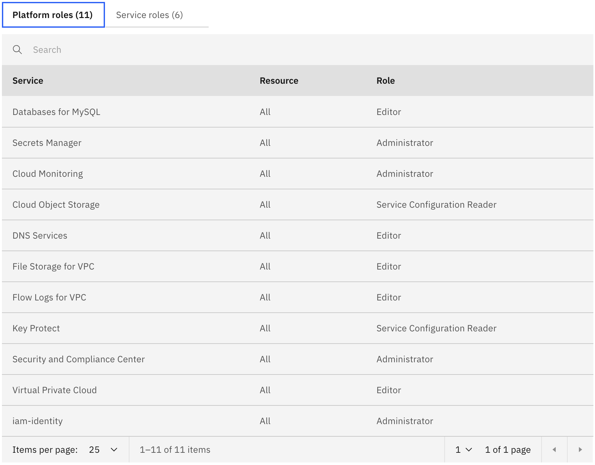
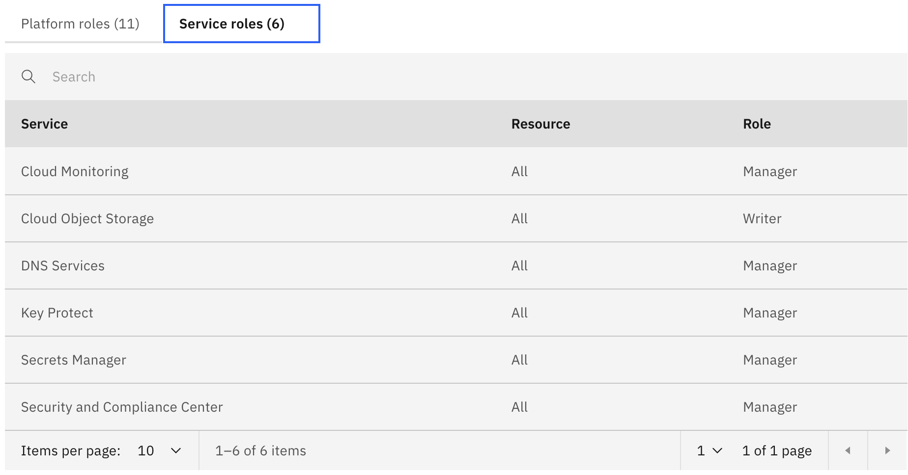

---

copyright:
  years: 2025
lastupdated: "2025-04-02"

keywords:

subcollection: hpc-ibm-spectrumlsf

---

{:shortdesc: .shortdesc}
{:codeblock: .codeblock}
{:screen: .screen}
{:external: target="_blank" .external}
{:pre: .pre}
{:tip: .tip}
{:note: .note}
{:important: .important}
{:step: data-tutorial-type='step'}
{:table: .aria-labeledby="caption"}

# Before you begin deploying
{: #getting-started-tutorial}

{{site.data.keyword.spectrum_full}} enables users to deploy HPC clusters that use LSF as a scheduling software. The deployment is performed by using Terraform and {{site.data.keyword.bplong_notm}} as automation frameworks.

## Confirm your {{site.data.keyword.cloud}} settings
{: #confirm-cloud-settings}

Complete the following steps before you deploy the {{site.data.keyword.spectrum_full}} deployable architecture.

1. Confirm that you have an {{site.data.keyword.cloud_notm}} Pay-As-You-Go or Subscription account. If you have a Trial or Lite account, [upgrade your account](/docs/account?topic=account-upgrading-account).

2. Log in to your [{{site.data.keyword.cloud_notm}}](https://cloud.ibm.com){: external} account with your IBMid.

## Verify access policies
{: #verify-access-policies}

{{site.data.keyword.iamlong}} (IAM) access policies are required to install this deployable architecture and provision clusters.

To view access policies, complete the following steps:

1. In the {{site.data.keyword.cloud_notm}} console, select **Manage > Access (IAM)**.
2. In the _IAM_ navigation menu, select **Users** and then select the account user.
3. Select **Access** to view the associated access policies and access groups. See the following table for the permissions that you need for this deployable architecture:

   | Service | Resources | Role |
   | ------- | --------- | ---- |
   | Database for MySQL (see note)| All | Administrator |
   | {{site.data.keyword.cloud_notm}} Project | All | Administrator |
   | All IAM Account Management services| All | Editor, Operator, Service ID creator, VPN Administrator, User API key creator, API key reviewer |
   | Security and Compliance Center | All | Editor, Viewer, Reader, Manager |
   | Resource group only | All resource groups in the account | Editor, Viewer |
   | Schematics | All | Manager, Editor |
   | DNS Services | All | Manager, Editor |
   | Key Protect | All | Manager, Editor |
   | Cloud Monitoring| All | Reader, Manager, Editor, Viewer |
   | Cloud Logs| All | Reader, Manager, Editor, Viewer |
   | Cloud Object Storage | All | Writer, Editor |
   | Activity Track Event Routing | All | Writer, Editor, Key manager, Service configuration reader |
   | All Identity and Access enabled services | All | Writer, Reader, Viewer, Operator |
   | VPC Infrastructure Services | All | Writer, Editor |
   {: caption="Verify access policies" caption-side="bottom"}

The Database for MySQL access is required if your [{{site.data.keyword.spectrum_full}} cluster deployment includes LSF Application Center with high availability](/docs/hpc-ibm-spectrumlsf?topic=hpc-ibm-spectrumlsf-before-deploy-application-center), which is enabled by default.
{:note: .note}

## Allow access to {{site.data.keyword.cloud_notm}} public endpoints
{: #public-endpoints}

The {{site.data.keyword.spectrum_full}} deployable architecture requires access to the following {{site.data.keyword.cloud_notm}} service API public endpoints. For a successful deployment to provision the infrastructure and the associated services, ensure that you are aware of these endpoints and allow them access:

| Endpoint | Type | Notes |
   | ------- | --------- | ---- |
   | `iam.cloud.ibm.com` | IAM | The IAM endpoint is protected by Akamai under the [Akamai IP ranges](https://techdocs.akamai.com/origin-ip-acl/docs/update-your-origin-server){: external} |
{: caption="{{site.data.keyword.cloud_notm}} public endpoints required for {{site.data.keyword.cloud_notm}} HPC deployment" caption-side="bottom"}

## Gather LSF entitlement information
{: #gather-lsf-entitlement-information}

The offering uses Bring Your Own Licenses (BYOL) for {{site.data.keyword.spectrum_short}} when you deploy an LSF cluster on {{site.data.keyword.cloud_notm}}. For production clusters, work with your business owners or license management team to make sure that your organization has procured enough licenses to deploy the HPC cluster by using {{site.data.keyword.spectrum_full_notm}}. Failure to comply with licenses for production use of software is a violation of the [IBM International Program License Agreement](https://www.ibm.com/software/passportadvantage/programlicense.html){: external}.

The current solution no longer requires `ibm_customer_number`(ICN) for entitlement check before deploying the solution for non-production use. The solution is now available for use without ICN validation. Users can provision up to a maximum of 10 static worker nodes for evaluation or non-production use cases. If the number of worker nodes exceeds 10, it becomes the user responsibility to obtain the necessary entitlement check and licensing for those additional nodes in the production environment. For production use or for evaluating greater than 10 worker nodes, the user must purchase the necessary LSF licenses. To purchase the license, go to [Purchasing licenses](https://www.ibm.com/docs/en/devops-test-embedded/9.0.0?topic=licenses-purchasing).
{: important}

Before you can deploy your {{site.data.keyword.spectrum_short}} cluster, you need to create or gather some information. To get started, complete the following steps:

## Create an IBM Cloud API key
{: #create-api-key}
{: step}

Verify that you have an {{site.data.keyword.cloud_notm}} API key. For more information, see [Creating an API key](/docs/account?topic=account-userapikey&interface=ui#create_user_key).

## Create an SSH key
{: #create-ssh-key}
{: step}

Make sure that you have an SSH key that you can use for authentication and that it is uploaded to {{site.data.keyword.vpc_short}}. The {{site.data.keyword.spectrum_full}} deployable architecture supports either RSA or Ed 25519 key types. This key is used to log in to all VSIs that you create. Make sure that you use the same key types in an LSF cluster (for example, deploy management and compute nodes with the same key). For more information about creating SSH keys, see [SSH keys](/docs/vpc?topic=vpc-ssh-keys).

## Generate the remote IP to access Spectrum LSF cluster
{: #generate-remote-ip}
{: step}

Generate an public IP address that is required to access the Spectrum LSF cluster nodes. click [here](https://ipv4.icanhazip.com).

If an Admin requires cluster access, they should provide the IP address from which the cluster will be accessed, whether from a local system or a virtual server instance. For multiple users, access can be granted by specifying a CIDR range.
{: note}

## Choose between IBM-managed or user-managed encryption
{: #encryption}
{: step}

By default, VPC volumes and file shares are encrypted with IBM-managed encryption. However, you can opt for user-managed encryption per your security requirements. Customer-managed encryption uses your root key, which gives you complete control over your data. You can provision or import existing encrypted keys by using {{site.data.keyword.keymanagementservicefull_notm}}.

If you decide to use user-managed encryption, complete the following steps before you deploy your {{site.data.keyword.spectrum_full}} architecture:

1. [Provision an instance of Key Protect](/docs/key-protect?topic=key-protect-provision#provision-gui)
2. [Create or import key](/docs/key-protect?topic=key-protect-getting-started-tutorial#get-started-keys)
3. [Authorize access between](/docs/vpc?topic=vpc-vpc-encryption-planning#byok-volumes-prereqs):
    * Cloud Block Storage and the key management service
    * File Storage for VPC and the key management service
4. Gather information for the following boot volume encryption deployment values (you provide this information when you deploy your {{site.data.keyword.spectrum_full}} architecture):
    * `enable_customer_managed_encryption`: Gives you toggling options.
    * `kms_instance_id`: Instance ID of the Key Protect instance that you create.
    * `kms_key_name`: Name of the KMS key that you create

Customer-managed encryption applies only to the bastion, login, and management nodes. The compute nodes are still IBM-managed.
{: note}

## Select the method for accessing the cluster
{: #select-method-for-accessing-cluster}
{: step}

Access the bastion node in the cluster directly or through a VPN gateway. You set your method during [cluster deployment](/docs/hpc-ibm-spectrumlsf?topic=hpc-ibm-spectrumlsf-deployment-values) as optional deployment input values:

1. Directly through a floating IP that is attached to the bastion node. If you select a value of **true** for the `enable_fip` deployment input variable, then a floating IP is attached to the bastion node. If you are connecting to the LSF cluster through VPN gateway, set this value to **false**. If not specified, this deployment value is set to **true**.

2. Through a VPN gateway. If you select a value of **true** for the `vpn_enabled` deployment input variables, it results in the creation of a VPN gateway. If you select the use of a VPN gateway, a floating IP is not attached to the bastion node. If not specified, this deployment value is set to **false**.

Regardless of which access method you select, values for `remote_allowed_ips` must be provided to identify a list of IP addresses of systems that can access the bastion node. From the bastion node, you can SSH into the primary management or login nodes, and from there, you can access compute nodes that are active in the cluster.

See the following example SSH command syntax for accessing different types of nodes:

* Primary management node:

    ```ssh
    ssh -o StrictHostKeyChecking=no -o UserKnownHostsFile=/dev/null -J ubuntu@149.81.242.172 lsfadmin@10.241.0.8
    ```
    {: codeblock}

* Login node:

    ```ssh
    ssh -o StrictHostKeyChecking=no -o UserKnownHostsFile=/dev/null -J ubuntu@149.81.216.117 lsfadmin@10.241.16.5
    ```
    {: codeblock}

* Compute node:

    ```ssh
    ssh lsfadmin@10.241.0.11
    ```
    {: codeblock}

This worker node instance type supports a combination of multiple instance profile type that might be chosen for different number of instance count.
For example, you might choose 100 instance to be created from `bx2-4x16` and 10 instance from `mx3d-8x80`. So, you would get a total count of 110 static worker nodes with different instance profile, based on your requirement.

## Next steps
{: #getting-started-next-steps}
{: step}

After you gather the necessary input values to define your cluster configuration, you are ready to deploy your {{site.data.keyword.spectrum_full_notm}} cluster.

After you create and gathered your information and reviewed any additional prerequisites for your interface of choice, you are ready to begin [Deploying IBM Spectrum LSF](/docs/hpc-ibm-spectrumlsf?topic=hpc-ibm-spectrumlsf-deploy-architecture&interface=ui).

Required IAM permissions to deploy the {{site.data.keyword.spectrum_full_notm}} cluster:

{: caption="Granting user permissions - Platform roles" caption-side="bottom"}

{: caption="Granting user permissions - Service roles" caption-side="bottom"}

Before an actual deployment is done, you need to analysis the required amount of capacity in terms of vCPU, memory, and so on, so that the deployment does not fail due to capacity concerns.
{: note}
