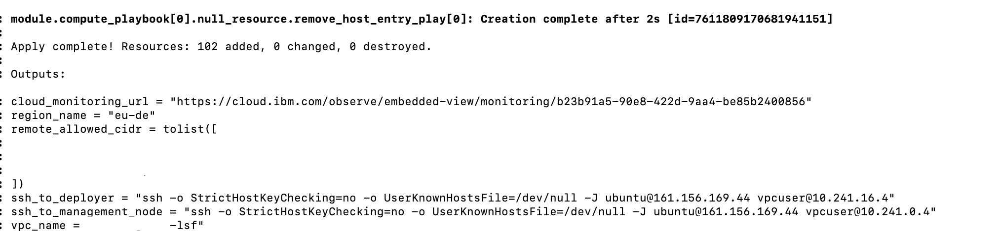

---

copyright:
  years: 2025
lastupdated: "2025-06-26"

keywords:

subcollection: hpc-ibm-spectrumlsf

---

{:shortdesc: .shortdesc}
{:codeblock: .codeblock}
{:screen: .screen}
{:external: target="_blank" .external}
{:pre: .pre}
{:tip: .tip}
{:note: .note}
{:important: .important}
{:step: data-tutorial-type='step'}
{:table: .aria-labeledby="caption"}

# Before you begin deploying
{: #getting-started-tutorial}

{{site.data.keyword.spectrum_full}} allows users to deploy HPC clusters with LSF as the scheduling software, leveraging Terraform and IBM Cloud Schematics for automation.

IBM Spectrum LSF solution does not support baremetal based deployments. All the deployments are based upon the VSI, make sure to provide the valid instance profiles.
{: important}

## Confirm your {{site.data.keyword.cloud}} settings
{: #confirm-cloud-settings}

Complete the following steps before you deploy the {{site.data.keyword.spectrum_full}} deployable architecture.

1. Confirm that you have an {{site.data.keyword.cloud_notm}} Pay-As-You-Go or Subscription account. If you have a Trial or Lite account, [upgrade your account](/docs/account?topic=account-upgrading-account).

2. Log in to your [{{site.data.keyword.cloud_notm}}](https://cloud.ibm.com){: external} account with your IBMid.

## Verify access policies
{: #verify-access-policies}

{{site.data.keyword.iamlong}} (IAM) access policies are required to install this deployable architecture and provision clusters.

To view access policies, complete the following steps:

1. In the {{site.data.keyword.cloud_notm}} console, select **Manage > Access (IAM)**.
2. In the _IAM_ navigation menu, select **Users** and then select the account user.
3. Select **Access** to view the associated access policies and access groups. See the following table for the permissions that you need for this deployable architecture:

   | Service | Resources | Platform roles | Service roles |
   | ------- | --------- | ---- | ---- |
   | Cloud Monitoring | All | Administrator | Manager |
   | Cloud Object Storage | All | Service Configuration Reader | Writer |
   | DNS Services | All | Editor | Manager |
   | File Storage for VPC | All | Editor | -- |
   | Flow Logs for VPC | All | Editor | -- |
   | IAM Identity Service | All | Administrator | -- |
   | Key Protect | All | Service Configuration Reader | Manager |
   | Secrets Manager | All | Administrator | Manager |
   | Security and Compliance Center | All | Administrator | Manager |
   | Virtual Private Cloud | All | Editor | -- |
   {: caption="Verify access policies" caption-side="bottom"}

## Gather LSF entitlement information
{: #gather-lsf-entitlement-information}

The offering uses Bring Your Own Licenses (BYOL) for {{site.data.keyword.spectrum_short}} when you deploy an LSF cluster on {{site.data.keyword.cloud_notm}}. For production clusters, work with your business owners or license management team to make sure that your organization has procured enough licenses to deploy the HPC cluster by using {{site.data.keyword.spectrum_full_notm}}. Failure to comply with licenses for production use of software is a violation of the [IBM International Program License Agreement](https://www.ibm.com/software/passportadvantage/programlicense.html){: external}.

The current solution no longer requires `ibm_customer_number`(ICN) for entitlement check before deploying the solution for non-production use. The solution is now available for use without ICN validation. Users can provision up to a maximum of 10 static worker nodes for evaluation or non-production use cases. If the number of worker nodes exceeds 10, it becomes the user responsibility to obtain the necessary entitlement check and licensing for those additional nodes in the production environment. For production use or for evaluating greater than 10 worker nodes, the user must purchase the necessary LSF licenses. To purchase the license, go to [Purchasing licenses](https://www.ibm.com/docs/en/devops-test-embedded/9.0.0?topic=licenses-purchasing).
{: important}

Before you can deploy your {{site.data.keyword.spectrum_short}} cluster, you need to create or gather some information. To get started, complete the following steps:

## Create an IBM Cloud API key
{: #create-api-key}
{: step}

Verify that you have an {{site.data.keyword.cloud_notm}} API key. For more information, see [Creating an API key](/docs/account?topic=account-userapikey&interface=ui#create_user_key).

## Create an SSH key
{: #create-ssh-key}
{: step}

Make sure that you have an SSH key that you can use for authentication and that it is uploaded to {{site.data.keyword.vpc_short}}. The {{site.data.keyword.spectrum_full}} deployable architecture supports either RSA or Ed 25519 key types. This key is used to log in to all VSIs that you create. Make sure that you use the same key types in an LSF cluster (for example, deploy management and compute nodes with the same key). For more information about creating SSH keys, see [SSH keys](/docs/vpc?topic=vpc-ssh-keys).

## Generate the remote IP to access Spectrum LSF cluster
{: #generate-remote-ip}
{: step}

This is a mandatory value configured through the Catalog tile and requires a valid IP address range or CIDR format to allow access to the LSF cluster.

If this field is left empty (for example, [""]) or not provided, then the cluster deployment will fail during the initial setup phase. It is essential to supply a valid entry to proceed with a successful deployment.

For more information on mandatory and optional deployment values, see [Deployment values](/docs/hpc-ibm-spectrumlsf?topic=hpc-ibm-spectrumlsf-deployment-values) topic.

## Support for lsf_version
{: #lsf-version}
{: step}

IBM Spectrum LSF currently supports both Fix Pack 14 (FP14) and Fix Pack 15 (FP15).
By default, the IBM Spectrum LSF solution now ships with Fix Pack 15 (FP15) to provide users with the most up-to-date features and support. For more information, see [Fix Pack 15](/docs/hpc-ibm-spectrumlsf?topic=hpc-ibm-spectrumlsf-fixpack).

## Application center password
{: #app-center}
{: step}

For both FP14 and FP15, Application Center is enabled by default to support job submission, workflow management, and monitoring.
To access the GUI, a valid password must be provided. If an appropriate password is not specified, the deployment fails.

## Enabling optional values
{: #optional-values}
{: step}

IBM Spectrum LSF also provides some optional or advanced features such as Observability, Monitoring, Cloud Logs, SCC integration, Hyperthreading, Existing Bastion Support, KMS and more.

If you want to enable and configure any of these features for your cluster, ensure to update the corresponding values accordingly. Note that certain features may be enabled by default.

Additionally, ensure that the necessary IAM permissions are in place when enabling these features. The required IAM permissions are mentioned in the above section [Verify access policies](/docs/hpc-ibm-spectrumlsf?topic=hpc-ibm-spectrumlsf-getting-started-tutorial#verify-access-policies).

## Select the method for accessing the cluster
{: #select-method-for-accessing-cluster}
{: step}

The values for `remote_allowed_ips` must be provided to identify a list of IP addresses of systems that can access the bastion node. All the cluster nodes can be directly accessed through bastion nodes (except dynamic nodes).

See the following example SSH command syntax for accessing different types of nodes:

* Deployer node:

    ```ssh
    ssh -o StrictHostKeyChecking=no -o UserKnownHostsFile=/dev/null -J ubuntu@<replace this with your bastion_node IP address> vpcuser@<replace this with your deployer_node IP address>
    ```
    {: codeblock}

* Login node:

    ```ssh
    ssh -o StrictHostKeyChecking=no -o UserKnownHostsFile=/dev/null -J ubuntu@<replace this with your bastion_node IP address> lsfadmin@<replace this with your login_node IP address>
    ```
    {: codeblock}

* Management node:

    ```ssh
    ssh -o StrictHostKeyChecking=no -o UserKnownHostsFile=/dev/null -J ubuntu@<replace this with your bastion_node IP address> lsfadmin@<replace this with your management_node IP address>
    ```
    {: codeblock}

* Static compute node:

    ```ssh
    ssh -o StrictHostKeyChecking=no -o UserKnownHostsFile=/dev/null -J ubuntu@<replace this with your bastion_node IP address> lsfadmin@<replace this with your static_compute_node IP address>
    ```
    {: codeblock}

{: caption="Command output" caption-side="bottom"}

This worker node instance type supports a combination of multiple instance profile type that might be chosen for different number of instance count.
For example, you might choose 100 instance to be created from `bx2-4x16` and 10 instance from `mx3d-8x80`. So, you would get a total count of 110 static worker nodes with different instance profile, based on your requirement.

## Next steps
{: #getting-started-next-steps}
{: step}

After you gather the necessary input values to define your cluster configuration, you are ready to deploy your {{site.data.keyword.spectrum_full_notm}} cluster.

After you create and gathered your information and reviewed any additional prerequisites for your interface of choice, you are ready to begin [Deploying IBM Spectrum LSF](/docs/hpc-ibm-spectrumlsf?topic=hpc-ibm-spectrumlsf-deploy-architecture&interface=ui).

Before an actual deployment is done, you need to analysis the required amount of capacity in terms of vCPU and memory, so that the deployment does not fail due to capacity concerns.
{: note}
