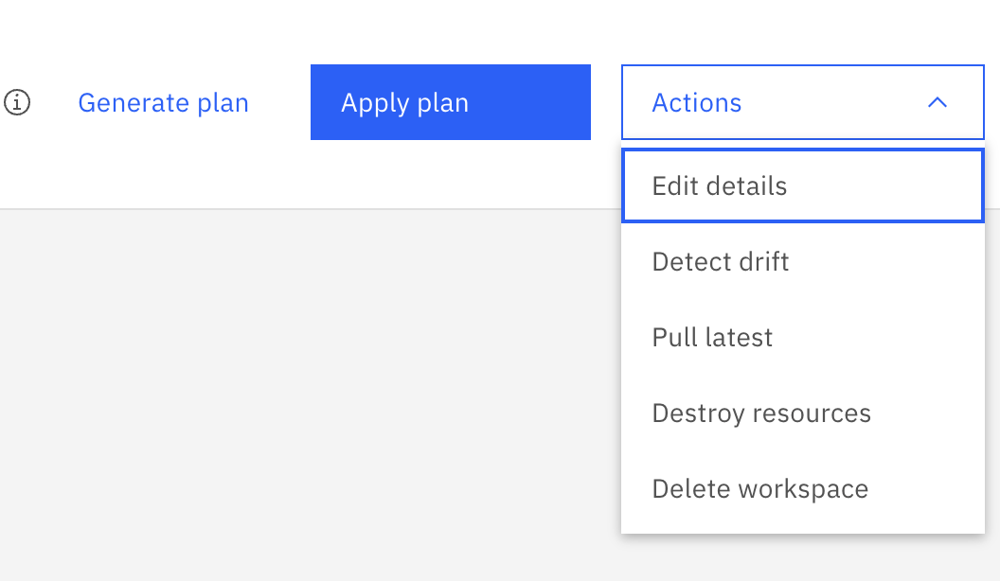

---

copyright:
  years: 2025
lastupdated: "2025-06-27"

keywords:

subcollection: hpc-ibm-spectrumlsf

---

{:shortdesc: .shortdesc}
{:codeblock: .codeblock}
{:screen: .screen}
{:external: target="_blank" .external}
{:pre: .pre}
{:tip: .tip}
{:note: .note}
{:important: .important}
{:ui: .ph data-hd-interface='ui'}
{:cli: .ph data-hd-interface='cli'}
{:api: .ph data-hd-interface='api'}
{:table: .aria-labeledby="caption"}

# Cleaning up deployed environments
{: #cleaning-up-deployed-environments}

You can clean up the {{site.data.keyword.spectrum_full_notm}} cluster from the environment if no longer needed. The process is in three phases:
1. Destroy all the associated VPC resources and remove them from your {{site.data.keyword.cloud_notm}} account
2. Remove the workspace
3. Verify that the cluster is free of running jobs or working compute nodes
{: shortdesc}

## Destroying resources by using the UI
{: #deleting-resources-ui}
{: ui}

1. In the {{site.data.keyword.cloud_notm}} console, navigate to **Projects > _project_name_ > Configurations > _project_configuration_name_ > Resources** tab, and click the link for the workspace, and select **Actions > Destroy resources** to delete all of the related VPC resources that were deployed as part of that workspace.
2. If you select the option to destroy resources, decide whether you want to destroy all of them. This action cannot be undone.
3. Confirm the action by entering the workspace name in the text box and click **Destroy**.

If successful, the **Jobs** view, you should see a `Workspace destroy successful` message. If unsuccessful, Schematics throws an error and shows a failure status.

## Deleting a workspace by using the UI
{: #deleting-workspace-ui}
{: ui}

1. In the {{site.data.keyword.cloud_notm}} console, the navigate to **Projects > _project_name_ > Configurations > _project_configuration_name_ > Resources** tab, and click the link for the workspace, and select **Actions > Delete workspace** to delete the workspace.
2. Confirm the action by entering the workspace name in the text box and click **Delete**.

If unsuccessful, Schematics throws an error and shows a failure status.

{: caption="Destroy and delete resources" caption-side="bottom"}

Verify that the cluster is free of running jobs and working compute nodes.
{: note}

Verify that it is safe to destroy resources:

1. As the `lsfadmin` user, close all LSF queues and kill all jobs:
    ```console
    badmin qclose all
    bkill -u all 0
    ```
    {: codeblock}

2. Wait ten minutes (this value is the default idle time), and then check for running jobs:
    ```console
    bjobs -u all
    ```
    {: codeblock}

   Look for a `No unfinished job found` message.

3. Check that no working compute nodes (only management nodes) are listed:
  ```console
    bhosts -w
    ```
    {: codeblock}

If the cluster has no running jobs and no working compute nodes, then it is safe to destroy resources from this environment.

## Destroying resources by using the CLI
{: #deleting-resources-cli}
{: cli}

1. [Log in to the {{site.data.keyword.cloud_notm}} CLI](/docs/cli?topic=cli-ibmcloud_cli#ibmcloud_login).
2. Run the following command to remove your VPC resources from your workspace:

  ```console
    ibmcloud schematics destroy --id <workspace_ID>
    ```
    {: codeblock}

You can monitor the log files to view the deletion progress of all {{site.data.keyword.cloud_notm}} resources.
{: note}

## Deleting a workspace by using the CLI
{: #deleting-workspace-cli}
{: cli}

1. [Log in to the {{site.data.keyword.cloud_notm}} CLI](/docs/cli?topic=cli-ibmcloud_cli#ibmcloud_login).
2. Run the following command to delete your workspace:

  ```console
    ibmcloud schematics workspace delete --id <workspace_ID>
    ```
    {: codeblock}

You can monitor the log files to view the deletion progress of your workspace.
{: note}

If unsuccessful, Schematics throws an error and shows a failure status.

Verify that the cluster is free of running jobs and working compute nodes.
{: note}

Verify that it is safe to destroy resources:

1. As the `lsfadmin` user, close all LSF queues and kill all jobs:
    ```console
    badmin qclose all
    bkill -u all 0
    ```
    {: codeblock}

2. Wait ten minutes (this value is the default idle time), and then check for running jobs:
    ```console
    bjobs -u all
    ```
    {: codeblock}

   Look for a `No unfinished job found` message.

3. Check that no working compute nodes (only management nodes) are listed:
  ```console
    bhosts -w
    ```
    {: codeblock}

If the cluster has no running jobs and no working compute nodes, then it is safe to destroy resources from this environment.
