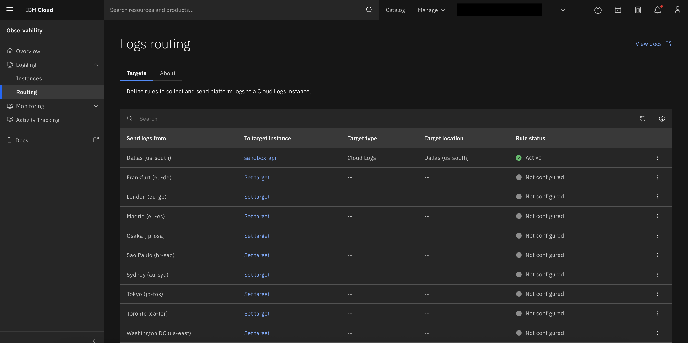

---

copyright:
  years: 2025
lastupdated: "2025-07-01"

keywords:

subcollection: hpc-ibm-spectrumlsf

---

{:shortdesc: .shortdesc}
{:codeblock: .codeblock}
{:screen: .screen}
{:external: target="_blank" .external}
{:pre: .pre}
{:tip: .tip}
{:note: .note}
{:important: .important}
{:step: data-tutorial-type='step'}
{:table: .aria-labeledby="caption"}

# IBM Cloud Logs
{: #cloud-logs-overview}

{{site.data.keyword.logs_full_notm}} is a scalable logging service, which is designed to persist logs while providing users with robust capabilities for querying, tailing, and visualizing their logs efficiently. This service supports enhanced observability for both management and compute resources in the {{site.data.keyword.cloud_notm}} environment.

## Key features
{: #key-features}

Following are the key features of {{site.data.keyword.logs_full_notm}}:

* Scalable log storage and persistence.

* Advanced querying, tailing, and visualization capabilities.

* Integration options for management and compute Virtual Server Instances (VSIs).

## Functionality
{: #cloud-log-functionality}

Solutions can be enabled for cloud logs to capture infrastructure and application logs from both management and compute nodes. Following are the variables to setup cloud logs:

* `observability_logs_enable_for_management`: Set this value as "false" to disable the {{site.data.keyword.logs_full_notm}} integration. If enabled, infrastructure and LSF application logs from management nodes are captured.

* `observability_logs_enable_for_compute`: Set this value as "false" to disable the {{site.data.keyword.logs_full_notm}} integration. If enabled, infrastructure and LSF application logs from compute nodes (static nodes or worker nodes) are captured.

* `observability_enable_platform_logs`: Setting this value as "true" creates a tenant in the same region in which the {{site.data.keyword.logs_full}} instance is provisioned to enable platform logs for that region. Run the following command to check whether the platform logs are enabled for your specified region:

    ```pre
    curl -X GET "https://management.<region>.logs-router.cloud.ibm.com:443/v1/tenants" \
    -H "Authorization: Bearer $(ibmcloud iam oauth-tokens | awk '{print $4}')" \
    -H "IBM-API-Version: $(date +%Y-%m-%d)"
    ```

[CLI]{: tag-blue}

    ```pre
    curl -X GET "https://management.us-south.logs-router.cloud.ibm.com:443/v1/tenants" \
    -H "Authorization: Bearer $(ibmcloud iam oauth-tokens | awk '/IAM token/ {print $4}')" \
    -H "IBM-API-Version: $(date +%Y-%m-%d)"

    {"tenants":[{"name":"us-south-1751346798861","id":"4844257c-47d6-4d3c-b022-d2691ebb0711","crn":"crn:v1:bluemix:public:logs-router:us-south:a/19066a3fe4ca466a810f7278fc902dc9:4844257c-47d6-4d3c-b022-d2691ebb0711::","created_at":"2025-07-01 05:13:20.607943 +0000 UTC","updated_at":"2025-07-01 05:13:20.607943 +0000 UTC","write_status":{"status":"unknown"},"etag":"\"62ffe53666dbf646de2b9dfc8a31e6bb2a6915dcd2296dce80ca52040f4a6b04\"","targets":[{"name":"target-36aafd11-80f5-44b6-ab0","id":"f7226f32-b9d3-4067-8ec3-bfcc66e6e333","type":"logs","log_sink_crn":"crn:v1:bluemix:public:logs:us-south:a/19066a3fe4ca466a810f7278fc902dc9:750533e1-9d91-46dc-81be-af92179c8786::","created_at":"2025-07-01 05:13:20.607943 +0000 UTC","updated_at":"2025-07-01 05:13:20.607943 +0000 UTC","etag":"\"07b35eceed90ce9a18c1f83b9ba52a470213d77da6d543bd9ae26d09dec35007\"","parameters":{"host":"750533e1-9d91-46dc-81be-af92179c8786.ingress.us-south.logs.cloud.ibm.com","port":443}}]}]}
    ```

    ```pre
    curl -X GET "https://management.us-east.logs-router.cloud.ibm.com:443/v1/tenants" \
    -H "Authorization: Bearer $(ibmcloud iam oauth-tokens | awk '/IAM token/ {print $4}')" \
    -H "IBM-API-Version: $(date +%Y-%m-%d)"

    {"tenants":[]}
    ```

    If the output contains an empty tenants list, it means that the platform logs are not enabled for that region, and you can set the `observability_enable_platform_logs` variable to enable them.
    However, if the tenants list is not empty, then the platform logs are already enabled. Attempting to enable them again may result in an error like **CreateTenantWithContext failed: Forbidden**.

    The empty tenants list output looks `{“tenants”:[]}`

    If the tenants list is not empty, then the platform logs are already enabled.Attempting to enable them again may result in an error like **CreateTenantWithContext failed: Forbidden**.
    {: note}

    You can have only one tenant per region in an account.
    {: note}

[UI]{: tag-blue}

    {: caption="Logs Routing" caption-side="bottom"}

* `observability_logs_retention_period`: The number of days {{site.data.keyword.logs_full_notm}} retains the log data in priority insights. By default the value is set as 7, but the allowed values are 14, 30, 60, and 90.

## Verifying Log Flow
{: #verify-log-flow}

To ensure that the logs are successfully flowing to the {{site.data.keyword.logs_full_notm}} instance, test messages are sent through user data.

1. Go to the `cloud_logs_url` in the terraform output.
   For example: https://dashboard.us-east.logs.cloud.ibm.com/bf8eb7dd-1a4b-421d-9bde-2861fdc13b9a
2. On the left side, click Explore Logs > Logs.
3. The dashboard results in a visual confirmation of logs that are captured and flow.

{: caption="Verifying the log flow" caption-side="bottom"}

## Using Filters
{: #using-filters}

Users can apply filters based on the subsystem and application to refine the logs:

* To view the logs from management nodes only, select the **management** subsystem.

* To view the logs from compute nodes only, select the **compute** subsystem.

If your log instance is also configured as a target for {{site.data.keyword.atracker_short}}, additional application names might appear besides "LSF". To exclude audit events, filter by the LSF application names specifically.

To check whether the cloud logs agent are running on your VSI, SSH into the VSI and run:

`systemctl status fluent-bit`

For more detailed logs, run:

`journalctl -u fluent-bit -e`

For IBM Cloud Logs, RHEL8.8 and above version is supported.
{: note}

For more information on {{site.data.keyword.logs_full_notm}}, go to the documentation [Getting started with IBM Cloud Logs](/docs/cloud-logs?topic=cloud-logs-getting-started).
