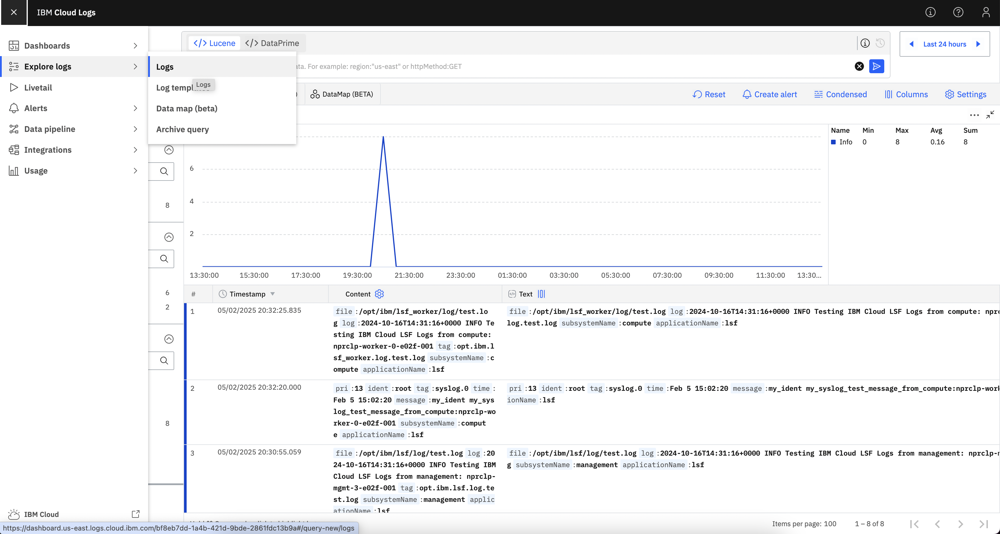

---

copyright:
  years: 2025
lastupdated: "2025-02-07"

keywords: 

subcollection: hpc-ibm-spectrumlsf

---

{:shortdesc: .shortdesc}
{:codeblock: .codeblock}
{:screen: .screen}
{:external: target="_blank" .external}
{:pre: .pre}
{:tip: .tip}
{:note: .note}
{:important: .important}
{:step: data-tutorial-type='step'}
{:table: .aria-labeledby="caption"}

# IBM Cloud Logs
{: #cloud-logs-overview}

{{site.data.keyword.logs_full_notm}} is a scalable logging service which is designed to persist logs while providing users with robust capabilities for querying, tailing, and visualising their logs efficiently. This service supports enhanced observability for both management and compute resources in the {{site.data.keyword.cloud_notm}} environment.

## Key features
{: #key-features}

Following are the key features of {{site.data.keyword.logs_full_notm}}:

* Scalable log storage and persistence.

* Advanced querying, tailing, and visualisation capabilities.

* Integration options for management and compute Virtual Server Instances (VSIs).

## Functionality
{: #cloud-log-functionality}

Solutions can be enabled for cloud logs to capture infrastructure and application logs from both management and compute nodes. In order to setup cloud logs, following are the variables:

* `observability_logs_enable_for_management`: Set this value as "false" to disable the {{site.data.keyword.logs_full_notm}} integration. If enabled, infrastructure and LSF application logs from management nodes will be captured.

* `observability_logs_enable_for_compute`: Set this value as "false" to disables the {{site.data.keyword.logs_full_notm}} integration. If enabled, infrastructure and LSF application logs from compute nodes (static nodes or worker nodes) will be captured.

* `observability_enable_platform_logs`: Setting this value as "true" creates a tenant in the same region in which the {{site.data.keyword.logs_full}} instance is provisioned to enable platform logs for that region. Run the following command to check if the platform logs are enabled for your specified region:

    ```
    curl -X GET "https://management.<region>.logs-router.cloud.ibm.com:443/v1/tenants" \ 
    -H "Authorization: Bearer $(ibmcloud iam oauth-tokens | awk '{print $4}')" \
    -H "IBM-API-Version: $(date +%Y-%m-%d)"
    ```
    {: pre}

    If the output contains an empty tenants list, then it means that the platform logs are not enabled for that region, and you can set the `observability_enable_platform_logs` variable to enable them. 
    However, if the tenants list is not empty, then the platform logs are already enabled. Attempting to enable them again may result in an error like **CreateTenantWithContext failed: Forbidden**.

    You can have only one tenant per region in an account.
    {: note}

* `observability_logs_retention_period`: The number of days {{site.data.keyword.logs_full_notm}} retains the logs data in priority insights. By default the value is set as 7, but the allowed values are 14, 30, 60, and 90.

## Verifying Log Flow
{: #verify-log-flow}

To ensure that the logs are successfully flowing to the {{site.data.keyword.logs_full_notm}} instance, test messages are sent through userdata.

1. Go to the `cloud_logs_url` in the terraform output.
  For example: https://dashboard.us-east.logs.cloud.ibm.com/bf8eb7dd-1a4b-421d-9bde-2861fdc13b9a
2. On the left-hand side, click Explore Logs > Logs.
3. The dashboard results in a visual confirmation of logs captured and flow.

{: caption="Verifying the log flow" caption-side="bottom"}

## Using Filters
{: #using-filters}

Users can apply filters based on the subsystem and application to refine the logs:

* To view the logs from management nodes only, select the **management** subsystem.

* To view the logs from compute nodes only, select the **compute** subsystem.

If your log instance is also configured as a target for {{site.data.keyword.atracker_short}}, additional application names may appear besides "LSF". To exclude audit events, filter by the LSF application names specifically.

To check if the cloud logs agent are running on your VSI, SSH into the VSI and run:

`systemctl status fluent-bit`

For more detailed logs, run:

`journalctl -u fluent-bit -e`

For IBM Cloud Logs, we support RHEL8.8 and above.
{: note}

For more information on {{site.data.keyword.logs_full_notm}}, go to the documentation [here](/docs/cloud-logs?topic=cloud-logs-getting-started).
