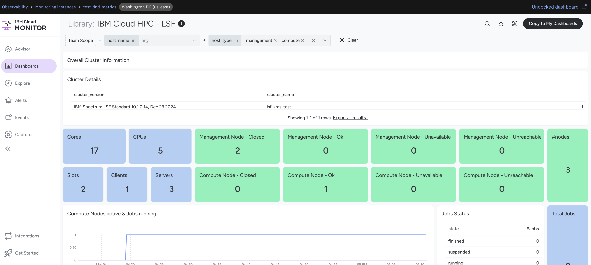
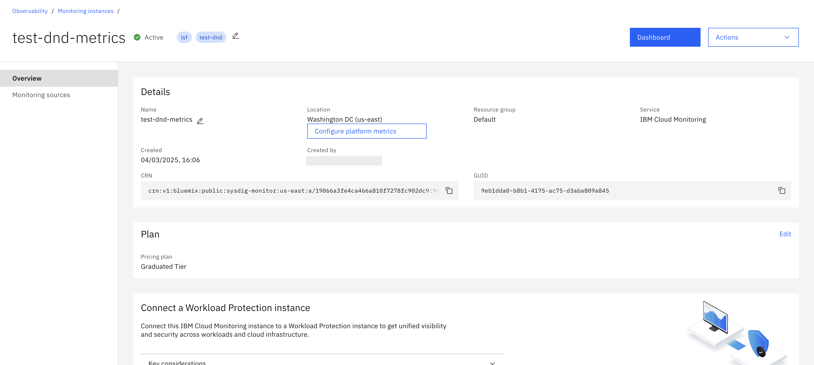

---

copyright:
  years: 2025
lastupdated: "2025-03-04"

keywords:

subcollection: hpc-ibm-spectrumlsf

---

{:shortdesc: .shortdesc}
{:codeblock: .codeblock}
{:screen: .screen}
{:external: target="_blank" .external}
{:pre: .pre}
{:tip: .tip}
{:note: .note}
{:important: .important}
{:step: data-tutorial-type='step'}
{:table: .aria-labeledby="caption"}

# IBM Cloud Monitoring
{: #cloud-monitoring-overview}

IBM Cloud® Monitoring is a cloud-native and container-intelligence management system that is included as part of your IBM Cloud architecture. The cloud monitoring is used to gain operational visibility into the performance and health of your applications, services, and platforms. It offers administrators, DevOps teams, and developers full-stack telemetry with advanced features to monitor and troubleshoot, define alerts, and design custom dashboards.

| Value | Description | Type | Default value | Validation |
| ----- | ----------- | --------------- | ------------ | ------------ |
| `observability_monitoring_enable` | Set this value as "false" to disable the {{site.data.keyword.monitoringlong_notm}} integration. If enabled, infrastructure and LSF application metrics only from management nodes are captured. | bool | true |
| `observability_monitoring_on_compute_nodes_enable` | Set this value as "false" to disable {{site.data.keyword.monitoringlong_notm}} integration. If enabled, infrastructure metrics from both static and dynamic compute nodes are captured. | bool | false |
| `observability_monitoring_plan` | This is a type of service plan for {{site.data.keyword.monitoringlong_notm}} instance. You can choose one of the following: lite or graduated-tier. For more information, refer to the [IBM Cloud Monitoring Service Plans](/docs/monitoring?topic=monitoring-service_plans). | string | "graduated-tier" | * Condition: Validates if the value matches lite or graduated-tier.  \n * Error Message: "Please enter a valid plan for {{site.data.keyword.monitoringlong_notm}}, for all details visit https://cloud.ibm.com/docs/monitoring?topic=monitoring-service_plans." |
| `observability_enable_metrics_routing` | Enable the metrics routing to manage metrics at the account level by configuring targets and routes that define how the data points are routed. | bool | false |
{: caption="{{site.data.keyword.monitoringlong_notm}} variables" caption-side="bottom"}

You can use {{site.data.keyword.metrics_router_full_notm}}, a platform service to manage metrics at the account-level by configuring targets and routes that define where data points are routed.

To check whether Cloud Monitoring is configured correctly on your VSI, SSH into the instance and run the following commands:

```
systemctl status prometheus
```
{: pre}

```
systemctl status dragent
```
{: pre}


Go to the `cloud_monitoring_url` in the terraform output.
For example: https://cloud.ibm.com/observe/embedded-view/monitoring/e68481cb-21ff-45bb-90db-cee02cebed3d

{: caption="Cloud Monitoring Dashboard" caption-side="bottom"}

Following are the steps to manually access the dashboard:

1. Go to Observability > Monitoring > Instances.
2. Search the name of the metrics instance.
3. On the right-side, click Dashboard.
4. The dashboard results in a visual confirmation of logs that are captured and flow.

  {: caption="Cloud Monitoring instances" caption-side="bottom"}

## Key features
{: #key-features}

Following are the key features of {{site.data.keyword.monitoringlong_notm}}:

* Consolidate time series data to the region of your primary operations.
* Route time series data to one or multiple locations.
* Improve your data residency compliance stature, keeping data at-rest within certain regions.

For more information on {{site.data.keyword.monitoringlong_notm}}, refer to the following documentation links:
* [About IBM Cloud Metrics Routing in IBM Cloud](/docs/metrics-router?topic=metrics-router-about&interface=ui)
* [Getting started with IBM Cloud Monitoring](/docs/monitoring?topic=monitoring-getting-started)
