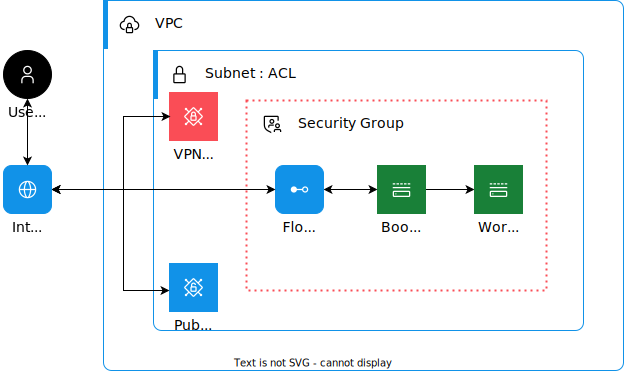

---

copyright:
  years: 2025
lastupdated: "2025-02-20"

keywords:

subcollection: hpc-ibm-spectrumlsf

---

{:shortdesc: .shortdesc}
{:codeblock: .codeblock}
{:screen: .screen}
{:external: target="_blank" .external}
{:pre: .pre}
{:tip: .tip}
{:note: .note}
{:important: .important}
{:table: .aria-labeledby="caption"}

# Creating a custom image for compute nodes
{: #custom-image}

The custom image builder tool enables the creation of pre-optimized images for compute nodes with IBM Spectrum LSF and essential open-source packages. If additional need to customize or install any third-party packages, use this tool to build private custom images tailored for your Spectrum LSF deployment. This automated solution starts with an IBM Cloud base image (stock image) and installs essential IBM Spectrum LSF components along with any prerequiste packages for the LSF images to work as defined and validates the final image. These custom images can be version-controlled and accessed through your private image catalog, providing flexibility and efficiency for maintaining and updating compute environments.
{: shortdesc}

## Features
{: #custom-image-builder}

The custom image builder is a tool that guides you through creating customized images for your {{site.data.keyword.spectrum_full}} environment, by using an automated process. Key features of the custom image builder include:

Tailored for your HPC environment
:  The custom image builder creates tailored images specifically for HPC environments by using an automated process. The automation helps ensure that images are optimized for workload management and performance. It handles software configuration and dependencies that are necessary to effectively manage compute nodes within the cluster.

Automated image creation
:  The custom image builder automatically builds and configures images by using Packer. This automation reduces manual intervention and helps ensure consistency across image deployments.

Support for multiple operating systems
:  The custom image builder supports images for RHEL and Rocky Linux&reg;, which provides flexibility for different HPC environments and software requirements.

Script-driven customization
:  To customize your images, you edit a user-provided script (`customer_script.sh`) and specify software packages, dependencies, and configurations specific to your business needs.

{{site.data.keyword.spectrum_full}} deployment validation
:  After the custom image builder creates the image, the automation validates it through {{site.data.keyword.spectrum_full}} deployment, which helps ensure that the image is functional and ready for use within the cluster.

Private catalog integration
:  You can add the created custom image to your private catalog within your IBM Cloud account to maintain a version history of the images created.

## Prerequisites
{: #custom-image-builder-prerequistes}

Before you use the custom image builder, you require prerequisites to be installed in the location (local host or a VSI) where you want to run the custom image deployment:
* [Git](https://git-scm.com/downloads){: external}: The necessary files and scripts for the custom image builder are available in a Git repository that you clone to your local directory. Make sure that you have Git for your platform.

    First, create a directory where you will clone the Git repository (for example, one called `mydirectory`):

    ```text
    cd <my-directory>
    ```
    {: codeblock}

    Then, clone the repository by running:
    ```text
    git clone https://github.com/terraform-ibm-modules/terraform-ibm-hpc/tree/main/tools/image-builder
    ```
    {: codeblock}

* [Terraform](https://developer.hashicorp.com/terraform/install){: external}: The custom image builder requires Terraform, as you run Terraform commands to build your custom image with the tool. Make sure that you have Terraform 1.9.0 or later installed.

    To determine the Terraform version installed, run:
    ```text
    terraform --version
    ```
    {: codeblock}

    If Terraform is not installed or if it requires updating, refer to the [Terraform site](https://developer.hashicorp.com/terraform/install){: external} for details.

For Terraform installation information, see the [Terraform documentation](https://developer.hashicorp.com/terraform/tutorials/aws-get-started/install-cli){: external}.

## Preinstalled software packages with the custom image builder
{: #custom-image-builder-software-included}

Along with Terraform, the custom image builder uses and installs the following software:
* Open-source [Packer](https://developer.hashicorp.com/packer/install){: external}: Used in the automation process to create custom images.
* Open-source [Go](https://go.dev/dl/){: external}: Employed to validate custom images through {{site.data.keyword.spectrum_full}} deployment as part of the automation workflow.

## Setting up your infrastructure
{: #custom-image-builder-setup}

The custom image builder uses a deployable architecture that helps ensure correctly established network, compute, and security configurations. This way, {{site.data.keyword.spectrum_full}} deployment is seamless and scalable. You can either provide existing infrastructure resources, or allow the model to dynamically create new ones, including essential infrastructure such as VPCs, VSIs, and security groups.

All custom image builder values are set in a `customer_script.sh` script, which you [clone from the custom image builder Git repository](https://github.com/terraform-ibm-modules/terraform-ibm-hpc/tree/main/tools/image-builder){: external}. Clone the repository to a platform from which you run the custom image builder. You can deploy from a local host or a VSI. After you clone, switch to the `tools/image-builder` directory.

You can provide existing values or leave them null so that the custom image builder automatically creates the values for you.

For example:
* You can provide an existing VPC, subnets, and security group. Otherwise, the automation creates new ones. For example, specify an existing VPC name for the `vpc_name` variable and the existing subnet IDs for the `subnet_id` variable. Otherwise, if the `vpc_name` value is set to null, the automation creates a new VPC, along with the subnets.

* You can provide an existing security group ID for the `security_group_id` variable, or you can leave it null so that the automation created an ID for you.

* You can provide an existing key management service (KMS) instance and key for start volume encryption for VSI-1:
    * For the `key_management` variable, specify the type of encryption you want to use. To use provider-managed encryption instead of {{site.data.keyword.keymanagementservicelong_notm}}, set the `key_management` value to null.
    * For the `key_instance_name` variable, specify the name of the existing {{site.data.keyword.keymanagementservicelong_notm}} instance to be used for boot volume encryption for VSI-1.
    * For the `kms_key_name` variable, specify the name of the existing KMS encryption key to be used for boot volume encryption for VSI-1.

If these KMS values are not provided, the automation creates a new KMS instance and key.

## Enabling a VPN
{: #custom-image-builder-vpn}

A VPN helps connect your on-premises network to the {{site.data.keyword.vpc_short}} network, which enables secure communication between the two environments.

The custom image automation supports creating a VPN gateway if you set the `enable_vpn` value as true (by default, it is set to false). After the automation creates the VPN gateway, you need to create VPN connections, and any other security group rule changes as necessary, under that VPN gateway. See the {{site.data.keyword.vpc_short}} documentation for details on [adding connections to a VPN gateway](/docs/vpc?topic=vpc-vpn-adding-connections&interface=ui).

If you are enabling a VPN, you do not require creating floating IP addresses. For example, if you enabled a VPN, to connect to VSI-1 without a floating IP address, run:
```text
ssh -o StrictHostKeyChecking=no -o UserKnownHostsFile=/dev/null root@${packer_vsi_1_private_ip}
```
{: codeblock}

By default, a floating IP is created and attached to VSI-1. If you do not require a floating IP, then set the `enable_fip` value to false.

## Creating a custom image
{: #custom-image-builder-create}

### Custom image builder workflow
{: #custom-image-builder-workflow}

With the custom image builder, you can write your own scripts to install extra packages (including open source packages, dependencies, and configuration requirements) for RHEL and Rocky Linux&reg; images, along with the essential packages installed. Use the provided `customer_script.sh` script as a template for your script. Provide values based on the operating system you choose for the `source_image_name` variable. Whenever a new dynamic node joins the cluster, all additional packages and necessary configuration are automatically included for the new nodes.

The custom image automation creates two VSIs: VSI-1 is a bootstrap node VSI, and VSI-2 is a worker node VSI.

{: caption="Custom image builder architecture" caption-side="bottom"}

The overall flow for creating your custom image by using the custom image builder is as follows:

1. With the bootstrap node VSI created, the automation installs the necessary version of open source Packer.

2. After Packer is installed, the automation triggers a new VSI for image-building purposes. Based on the value you provide for the `source_image_name` variable, the automation starts the worker node VSI and uses it to create the RHEL or Rocky Linux&reg; custom image based on your specifications, calling two scripts:

    * To include the LSF prerequisites in the custom image, the automation calls a `script.sh` script to install the appropriate LSF packages. To view installation logs on the bootstrap node, refer to the `var/log/cloud-init-output.log` file.
    * To include any additional open source packages in the custom image, the automation calls your `customer_script.sh` script with your predefined cusotmizations, after the `script.sh` script.

    When the installation completes, VSI-2 moves to stopped state and the image creation process begins.

3. After the worker node VSI creates the image, the automation helps ensure that the image is set to an available state. The automation then initiates {{site.data.keyword.spectrum_full}} deployment by using the new image to validate the deployment process, helping ensure that the new image is correct and can deploy successfully.

    The {{site.data.keyword.spectrum_full}} deployment requests the `cluster_id` and IBM user number deployment input values, as they are necessary to validate the {{site.data.keyword.spectrum_full}} deployment from the newly created custom image.
    {: tip}

4. (Optional): The custom image builder also requires the `private_catalog_id` where the new image is added, published, and then shared with other necessary accounts. If you do not provide a catalog ID, then the image is created and validated.

### Running the custom image builder
{: #custom-image-builder-running}

To create your custom image with the custom image builder, you edit a `variables.tf` file, and then run Terraform commands.

Make sure that Terraform is installed as outlined in the [prerequisites](#custom-image-builder-prerequistes).
{: tip}

To create your custom image:
1. Go to the project directory where you cloned the custom image builder repository. For example:

    ```text
    cd <mydirectory>/tools/image-builder
    ```
    {: codeblock}

2. Edit the `variables.tf` file with input parameters and values.

3. Run the image builder commands:
    ```text
    terraform init
    terraform plan
    terraform apply
    ```
    {: codeblock}

  Apply complete! Resources: 36 added, 0 changed, 0 destroyed.

  Outputs:
    ```text
    packer_vsi_name = "test-lsf-packer-ccf4-001"
    ssh_to_packer_vsi = "ssh -o StrictHostKeyChecking=no -o UserKnownHostsFile=/dev/null root@165.192.133.183"
    subnet_id = "02g7-fc720c96-ec50-43d2-919a-e33b4566ccf4"
    vpc_id = "r022-016dbd43-fec6-4a81-9e85-c5d1cfe03ee5"
    ```
    {: codeblock}

4. Use validation logs to see the status and troubleshoot any issues:

* For Packer logs and script execution logs for the custom image builder, log in to VSI-1 (the bootstrap node) and check the `/var/log/cloud-init-output.log` user data log.
* For {{site.data.keyword.spectrum_full}} deployment with the new custom image, access the full run log from VSI-1 at `<mydirectory>/terraform-ibm-hpc-tools/tests/<log_file_name_with_date>`.
* For {{site.data.keyword.spectrum_full}} deployment validation, dynamic node creation, and catalog validation, view the log files from VSI-1 at `<mydirectory>/terraform-ibm-hpc-tools/tests/test_output/log_*.log`.

## Manually sharing the custom image to make it accessible to {{site.data.keyword.spectrum_full_notm}}
{: #custom-image-share}

If you used the custom image builder, that automatically shares the custom image with the {{site.data.keyword.cloud_notm}} HPC back-end service. You can use it to deploy new dynamic compute nodes with the image. You do not need the following manual steps.
{: tip}

If you need to share your custom image manually, follow these steps.

By default, anyone outside of your {{site.data.keyword.cloud_notm}} account cannot access your private images as they are created within your {{site.data.keyword.cloud_notm}} account. If you manually created custom image, share it with the {{site.data.keyword.spectrum_full_notm}} back-end service so that you can use it to deploy new dynamic compute nodes with the image.

To share private images and make them accessible by other accounts:
1. Create a private catalog. Select **Product (default)** as the catalog type during creation. For more information, see the [{{site.data.keyword.cloud_notm}} video](/docs/account?topic=account-cm-video&interface=ui) and [documentation](/docs/account?topic=account-create-private-catalog&interface=ui#create-catalog-ui).

2. Create a private offering in the private catalog:
    1. In the {{site.data.keyword.cloud_notm}} console, select **Manage > Catalogs > Private catalogs** to access the private catalog you created in the previous step.
    2. Add a product to this private catalog by selecting the private catalog name and selecting **Add Product**. Use the following information for your custom image, and then select to add the new product:
        * Product type: **Software**
        * Delivery method: **Virtual server image for VPC**
        * Architecture method: **x86**
        * Region: Select the region for the custom image.
        * Available images: Select the custom image.
        * Software version: Provide the software version, in the format major version, minor version, and revision, for example, **1.0.0**.
        * Category: **Compute/Cloud Images**
    3. From the **Products** list, click the product that you created in the previous step, and select the **Versions** view.
    4. From the **Versions** list, select **Validate** from the action menu. Validation triggers an automated task to deploy a new VSI with the custom image that you added to the catalog.

    For more information about sharing private catalog products, see [{{site.data.keyword.cloud_notm}} documentation](/docs/secure-enterprise?topic=secure-enterprise-catalog-enterprise-share&interface=ui).

### Associating your custom image with the {{site.data.keyword.spectrum_full_notm}} deployable architecture
{: #custom-image-crn}

When you deploy your {{site.data.keyword.spectrum_full}} cluster with a custom image, you specify the `compute_image_name` deployment input value with the custom image that you want to use to create VSIs in your {{site.data.keyword.cloud_notm}} account to deploy the {{site.data.keyword.spectrum_full}} cluster dynamic compute nodes. Provide the [Cloud Resource Name (CRN)](/docs/account?topic=account-crn) of the custom image as the `compute_image_name` value.

A CRN uniquely identifies {{site.data.keyword.cloud_notm}} resources. It is used to specify a resource in an unambiguous way. To determine the CRN for your custom image, use the `ibmcloud catalog offering search` {{site.data.keyword.cloud_notm}} CLI command. For example:

```text
ibmcloud catalog offering search  --catalog <private_catalog_name> --offering <product_name> --version <product_version> --output JSON
```
{: codeblock}

The command output shows the CRN value for your product version. For details about this command, see the [{{site.data.keyword.cloud_notm}} CLI](docs/account?topic=account-manage-catalogs-plugin&interface=ui#search-catalog-offering-search).

After you determine the CRN for your custom image, use it for the [{{site.data.keyword.spectrum_full_notm}} cluster `compute_image_name` deployment input value](/docs/allowlist/hpc-service?topic=hpc-service-deploy-architecture&interface=ui).
