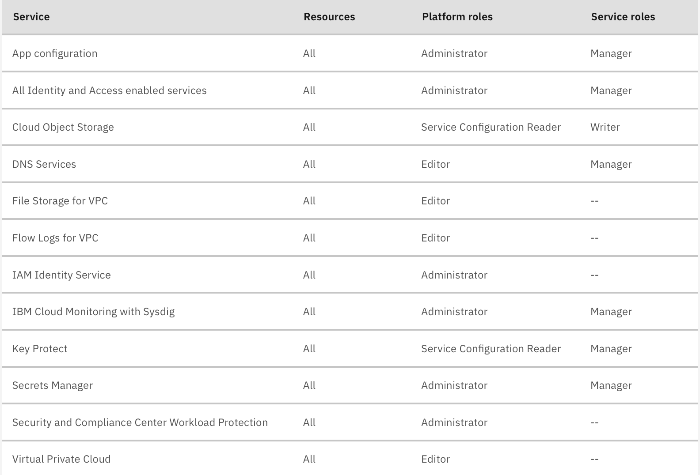

---

copyright:
  years: 2025
lastupdated: "2025-07-02"

keywords:

subcollection: hpc-ibm-spectrumlsf

content-type: faq

---

{:shortdesc: .shortdesc}
{:codeblock: .codeblock}
{:screen: .screen}
{:external: target="_blank" .external}
{:pre: .pre}
{:tip: .tip}
{:note: .note}
{:important: .important}
{:faq: data-hd-content-type='faq'}

# FAQs for Spectrum LSF
{: #spectrum-lsf-faqs}

This document provides a list of frequently asked questions and answers about a specific topic for {{site.data.keyword.spectrum_full_notm}}.

## What Spectrum LSF packages are included in a cluster deployed with this offering?
{: #my-faq-packages}
{: faq}

{{site.data.keyword.spectrum_full_notm}} Standard Edition is included in {{site.data.keyword.spectrum_short}} program.

## What locations are available for deploying VPC resources?
{: #locations-vpc-resources}
{: faq}

The available regions and zones for deploying VPC resources, mapping of those to city locations and data centers can be found in [Locations for resource deployment](/docs/overview?topic=overview-locations).

## What permissions do you need to create a cluster using the offering?
{: #permissions-cluster-offering}
{: faq}

The instructions to set the appropriate permissions for {{site.data.keyword.cloud_notm}} services platform roles and service roles can be seen in the below screenshots:

{: caption="Granting user permissions - Platform and Service roles" caption-side="bottom"}

## How do I SSH among nodes?
{: #ssh-among-nodes}
{: faq}

All the nodes in the LSF cluster have the same public key that you register at your cluster creation. You can use ssh-agent forwarding, which is a common technique to access remote nodes that have the same public key. It automates to securely forward private keys to remote nodes. Forwarded keys are deleted immediately after a session is closed.

To securely forward private keys to remote nodes, you need to do `ssh-add` and `ssh -A`.

```
[your local PC]~$ ssh-add {id_rsa for lsf cluster}
[your local PC]~# ssh -A -J root@jumpbox_fip root@management_private_ip
...
[root@management]~# ssh -A worker_private_ip
```
{: codeblock}

For Mac OS X, you can persist `ssh-add` by adding the following configuration to `.ssh/config`:

```
Host *
  UseKeychain yes
  AddKeysToAgent yes
```
{: codeblock}

You can even remove `-A` by adding "ForwardAgent yes" to `.ssh/config`.

## How many worker nodes can you deploy in the Spectrum LSF cluster through this offering?
{: #worker-nodes}
{: faq}

Before deploying a cluster, it is important to ensure that the VPC resource quota settings are appropriate for the size of the cluster that you would like to create (see [Quotas and service limits](/docs/vpc?topic=vpc-quotas)).

By default, the number of worker nodes supported for `dynamic_compute_instances` variable is 500 for the deployment. For more information, see [Deployment values](/docs/hpc-ibm-spectrumlsf?topic=hpc-ibm-spectrumlsf-deployment-values).

For the `static_compute_instances` variable, this worker node instance type supports a combination of multiple instance profile type that could be choosen for different number of instance count.
For example, you can choose to create 100 instance from `bx2-4x16` and 10 instance from `mx3d-8x80`. So you get totally a count of 110 static worker nodes with different instance profile, based upon your requirement.

The delta between those two variables specifies the maximum number of worker nodes that can either be created or destroyed by the LSF resource connector auto scaling feature. In configurations where that delta exceeds 250, it is recommended to take caution if the characteristics of the workload are expected to result in >250 cluster node join or remove operation requests at a single point in time. In those cases, it is recommended to pace the job start and stop requests, if possible. Otherwise, you might see noticeable delays in some subset of the nodes joining or being removed from the cluster.

If the requirement goes beyond 250 nodes, then it is recommended to use the IBM Storage Scale as the VPC file share has a hard limit of using 250 nodes. For more information, see [Integrating IBM Storage Scale with your IBM Spectrum LSF cluster](/docs/hpc-ibm-spectrumlsf?topic=hpc-ibm-spectrumlsf-integrating-scale&interface=ui).

## Why there are two different resource group parameters that can be specified in the IBM Cloud catalog tile?
{: #resource-group-parameters}
{: faq}

The first resource group parameter entry in the Configure your workspace section in the {{site.data.keyword.cloud_notm}} catalog applies to the resource group where the {{site.data.keyword.bpshort}} workspace is provisioned on your {{site.data.keyword.cloud_notm}} account. The value for this parameter can be different than the one used for the second entry in the Parameters with default values section in the catalog. The second entry applies to the resource group where VPC resources are provisioned. As specified in the description for this second `resource_group` parameter. Only the default resource group is supported for use of the LSF Resource Connector auto-scaling feature.

## Where are the Terraform files used by the {{site.data.keyword.spectrum_full_notm}} tile located?
{: #terraform-file-location}
{: faq}

The Terraform-based templates can be found in this [GitHub repository](https://github.com/terraform-ibm-modules/terraform-ibm-hpc){: external}.

## Where can you find the custom image name to image ID mappings for each cloud region?
{: #custom-image-mappings}
{: faq}

The mappings can be found in the `image-map.tf` file in this [GitHub repository](https://github.com/terraform-ibm-modules/terraform-ibm-hpc/blob/main/modules/landing_zone_vsi/image_map.tf){: external}.

## Which Spectrum LSF and Spectrum Scale versions are used in cluster nodes deployed with this offering?
{: #versions-used}
{: faq}

By default, cluster nodes that are deployed with this offering include {{site.data.keyword.spectrum_full_notm}} 10.1.0.15 IBM Spectrum LSF Suite for Enterprise.
And if you set the LSF version to 14, then the cluster nodes are deployed in **10.1.0.14** IBM Spectrum LSF Suite for Enterprise.

See the following for a brief description of each of those programs: [{{site.data.keyword.spectrum_full_notm}} 10 family of products](https://www.ibm.com/support/pages/ibm-spectrum-lsf-101-fix-pack-14-101014){: external}

If the cluster uses {{site.data.keyword.scale_short}} storage, the storage nodes include {{site.data.keyword.scale_full_notm}} 5.2.3 software. For more information, see the [{{site.data.keyword.scale_full_notm}}](https://www.ibm.com/docs/en/storage-scale/5.2.1){: external} product documentation.

## Why is the CPU number displayed on an LSF worker node different than what is shown in the LSF Application Center GUI?
{: #cpu-number-different-lsf-worker-nodes-and-application-center}
{: faq}

The CPU column in the LSF Application Center GUI and the `ncpus` column when you run the `lscpu` command on an LSF worker node might not show the same value.

The CPU column output that you get by running `lscpu | egrep 'Model name|Socket|Thread|NUMA|CPU(s)'` on an LSF worker node shows the number of CPU threads (not physical cores) on that compute instance.

If `EGO_DEFINE_NCPUS=threads`, then “ncpus=number of processors x number of cores x number of threads” and the CPU column value in the LSF Application Center GUI will match what you see when running `lscpu` on an LSF worker node.

If `EGO_DEFINE_NCPUS=cores`, then “ncpus=number of processors x number of cores” and the CPU column value in the LSF Application Center GUI will be half of what you see when running `lscpu` on an LSF worker node.

For more information, see [ncpus calculation in LSF](https://www.ibm.com/support/pages/ncpus-calculation-lsf#:~:text=If%20EGO_DEFINE_NCPUS%3Dthreads%2C%20then%20ncpus,cores%20x%20number%20of%20threads){: external}.

## What file storage for {{site.data.keyword.cloud_notm}} Virtual Private Cloud (VPC) profiles are supported for the {{site.data.keyword.spectrum_full}} cluster shared storage?
{: #file-storage-for-vpc-profiles}
{: faq}

{{site.data.keyword.filestorage_vpc_full_notm}} is a zonal file storage offering that provides NFS-based file storage services. You create file share mounts from a subnet in an availability zone within a region. You can also share them with multiple virtual server instances within the same zone across multiple VPCs. {{site.data.keyword.spectrum_full}} supports the use of [dp2 profiles](/docs/vpc?topic=vpc-file-storage-profiles&interface=ui#dp2-profile).

## Can you specify the total IOPS (input or output operations per second) for a file share when deploying an {{site.data.keyword.spectrum_short}} cluster?
{: #iops}
{: faq}

Yes, when you deploy an {{site.data.keyword.spectrum_short}} cluster, you can [choose the required IOPS value appropriate for your file share size](/docs/vpc?topic=vpc-file-storage-profiles&interface=ui#fs-tiers).

## How to share data, packages, or applications with {{site.data.keyword.spectrum_short}} compute nodes?
{: #share}
{: faq}

{{site.data.keyword.filestorage_vpc_full_notm}} with two file shares (`/mnt/binaries` or `/mnt/data`), and up to five file shares, is provisioned to be accessible by both {{site.data.keyword.spectrum_short}} management and compute nodes. To copy to a file share, SSH to the {{site.data.keyword.spectrum_short}} management node and use your file copy of choice (such as scp, rsync, or IBM Aspera) to the appropriate file share.

## What are the supported operating systems for dynamic node creation with {{site.data.keyword.spectrum_short}}?
{: #dynamic-node-creation}
{: faq}

You can deploy your {{site.data.keyword.spectrum_short}} environment to automatically create Red Hat Enterprise Linux (RHEL) compute nodes. The supported image for **static_compute_instances**/**dynamic_compute_instances**/**login_compute_instances** variables for Fix Pack 15 is `hpc-lsf-fp15-compute-rhel810-v1`.

The supported image for **static_compute_instances**/**dynamic_compute_instances**/**login_compute_instances** variables for Fix Pack 14 is `hpc-lsf-fp14-compute-rhel810-v1`.

As part of dynamic node provisioning, Ubuntu based operating system is not supported.

| LSF version | Deployer node | Management node | Login node | Compute node |
| ----- | ----------- | --------------- | ------------ | ------------ |
| Fix Pack 14 | "hpc-lsf-fp14-deployer-rhel810-v1" | "hpc-lsf-fp14-rhel810-v1" | hpc-lsf-fp14-compute-rhel810-v1 | hpc-lsf-fp14-compute-rhel810-v1 |
| Fix Pack 15 | "hpc-lsf-fp15-deployer-rhel810-v1" | "hpc-lsf-fp15-rhel810-v1" | hpc-lsf-fp15-compute-rhel810-v1 | hpc-lsf-fp15-compute-rhel810-v1 |
{: caption="Fix Pack images" caption-side="bottom"}

## As a cluster administrator, how do I best restart the LSF daemon processes?
{: #restarting_lsf-daemons}
{: faq}

A cluster administrator can choose to restart all the cluster daemons. In an {{site.data.keyword.spectrum_short}} environment, these daemons are the most used and relevant to LSF:
* `lim` (on all nodes)
* `res` (on all nodes)
* `sbatchd` (on all nodes)
* `mbatchd` (only on the primary management node)
* `mbschd` (only on the primary management node)

Other LSF processes exist, but they are started by these main daemons. Choose between two methods for restarting LSF daemon processes: a wrapper to run on each host, or commands to run to affect all hosts in the cluster.

### Restarting LSF daemons on an individual host
{: #restarting_lsf-daemons-one-host}

To restart the cluster daemons on an individual node, use the `lsf_deamons` script. To stop all the daemons on a node, run `lsf_deamons stop`.

Likewise, to start all the daemons on a node, run `lsf_deamons start`.

Repeat these commands on each node if you want to restart the full cluster. Run the commands on both management and compute nodes that join the cluster.

No daemons are run on the login node, as the login node is used for running particular tasks: to submit {{site.data.keyword.spectrum_short}} jobs; monitor {{site.data.keyword.spectrum_short}} job status; display hosts and their static resource information; display and filter information about LSF jobs; and display the LSF version number, cluster name, and the management hostname.
{: note}

### Restarting LSF daemons for all hosts in the cluster
{: #restarting_lsf-daemons-whole-cluster}

You can also restart all the daemons on all the hosts in your cluster, including both management nodes and compute nodes that join your cluster.

To restart all the daemons on all the nodes in your cluster, use the `lsfrestart` command.

To shut down all the daemons on all the nodes in your cluster, use the `lsfshutdown` command.

LSF also provides an `lsfstartup` command, which starts all the daemons on all the management (not compute) nodes in your cluster. If you have compute nodes that joined your cluster and you want to continue to use them (for example, after you run `lsfshutdown` to shut down all daemons on all hosts, which include the compute nodes), then you must SSH to connect to each host and run the `lsf_deamons start` script to bring back the compute nodes. Alternatively, since the compute nodes are within your {{site.data.keyword.spectrum_short}} environment, you can also leave them alone and they are returned to the resource pool in ten minutes (by default). New compute nodes can join upon new job requests.

No daemons are run on the login node, as the login node is used for running particular tasks: to submit {{site.data.keyword.spectrum_short}} jobs; monitor {{site.data.keyword.spectrum_short}} job status; display hosts and their static resource information; display and filter information about LSF jobs; and display the LSF version number, cluster name, and the management hostname.
{: note}

## How do I secure LSF Application Center connections by importing the `cacert.pem` certificate into a browser?
{: #secure-application-center-connection}
{: faq}

LSF Application Center requires that the `$GUI_CONFDIR/https/cacert.pem` certificate (generated by LSF Application Center) is installed in the browser to secure specific functions, such as remote consoles and HTTPS. [Import this certificate into your browser](https://www.ibm.com/docs/en/slac/10.2.0?topic=center-importing-cacertpem-certificate-into-client-browser){: external} to securely connect with {{site.data.keyword.spectrum_full_notm}} Application Center.

## What are the limitations of available profiles for dedicated hosts?
{: #limitations}
{: faq}

The offering automatically selects instance profiles for dedicated hosts to be the same prefix (for example, bx2 and cx2) as ones for worker instances (`static_compute_instances`). However, available instance prefixes can be limited, depending on your target region. If you use dedicated hosts, check `ibmcloud target -r {region_name}` and `ibmcloud is dedicated-host-profiles` to see whether your `static_compute_instances` has the available prefix for your target region.

## Why does `CreateTenantWithContext failed: Forbidden` error occur?
{: #logs}
{: faq}

**Output**

```pre
curl -X GET "https://management.us-east.logs-router.cloud.ibm.com:443/v1/tenants" \
-H "Authorization: Bearer $(ibmcloud iam oauth-tokens | awk '/IAM token/ {print $4}')" \
-H "IBM-API-Version: $(date +%Y-%m-%d)"

{"tenants":[]}
```

If the output (above) contains an empty tenants list, it means that the platform logs are not enabled for that region, and you can set the `observability_enable_platform_logs` variable to enable them. However, if the tenants list is not empty, then the platform logs are already enabled. Attempting to enable them again may result in an error like `CreateTenantWithContext failed: Forbidden`.

```pre
module.lsf.module.resource_provisioner.null_resource.tf_resource_provisioner[0] (remote-exec): │ Error: ---
module.lsf.module.resource_provisioner.null_resource.tf_resource_provisioner[0] (remote-exec): │ id: terraform-30ad67fe
module.lsf.module.resource_provisioner.null_resource.tf_resource_provisioner[0] (remote-exec): │ summary: 'CreateTenantWithContext failed: Conflict'
module.lsf.module.resource_provisioner.null_resource.tf_resource_provisioner[0] (remote-exec): │ severity: error
module.lsf.module.resource_provisioner.null_resource.tf_resource_provisioner[0] (remote-exec): │ resource: ibm_logs_router_tenant
module.lsf.module.resource_provisioner.null_resource.tf_resource_provisioner[0] (remote-exec): │ operation: create
module.lsf.module.resource_provisioner.null_resource.tf_resource_provisioner[0] (remote-exec): │ component:
module.lsf.module.resource_provisioner.null_resource.tf_resource_provisioner[0] (remote-exec): │  name: github.com/IBM-Cloud/terraform-provider-ibm
module.lsf.module.resource_provisioner.null_resource.tf_resource_provisioner[0] (remote-exec): │  version: 1.78.4
module.lsf.module.resource_provisioner.null_resource.tf_resource_provisioner[0] (remote-exec): │ ---
module.lsf.module.resource_provisioner.null_resource.tf_resource_provisioner[0] (remote-exec): │
module.lsf.module.resource_provisioner.null_resource.tf_resource_provisioner[0] (remote-exec): │
module.lsf.module.resource_provisioner.null_resource.tf_resource_provisioner[0] (remote-exec): │  with module.cloud_monitoring_instance_creation.module.observability_instance[0].module.cloud_logs[0].ibm_logs_router_tenant.logs_router_tenant_instances["jp-tok"],
module.lsf.module.resource_provisioner.null_resource.tf_resource_provisioner[0] (remote-exec): │  on .terraform/modules/cloud_monitoring_instance_creation.observability_instance/modules/cloud_logs/main.tf line 166, in resource "ibm_logs_router_tenant" "logs_router_tenant_instances":
```
