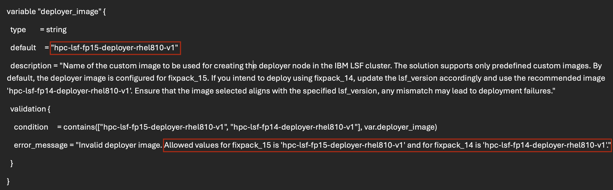

---

copyright:
  years: 2025
lastupdated: "2025-06-19"

keywords:

subcollection: hpc-ibm-spectrumlsf

---

{:shortdesc: .shortdesc}
{:codeblock: .codeblock}
{:screen: .screen}
{:external: target="_blank" .external}
{:pre: .pre}
{:tip: .tip}
{:note: .note}
{:important: .important}
{:table: .aria-labeledby="caption"}

# Fix Pack support
{: #fixpack-overview}

Fix Pack is the cumulative package that contains the repository files, security fixes, vulnerabilities fixes, resource connectors and so on. For {{site.data.keyword.spectrum_full}} Fix Pack 14 (FP14) and Fix Pack 15 (FP15) packages are used.

In last release, for {{site.data.keyword.spectrum_short}} cluster deployment Fix Pack 14 was supported. But now **Fix Pack 15** is supported along with Fix Pack 14.

The following table shows the different images used for FP14 and FP15:

| LSF version | Deployer node | Management node | Login node | Compute node |
| ----- | ----------- | --------------- | ------------ | ------------ |
| Fix Pack 14 | "hpc-lsf-fp14-deployer-rhel810-v1" | "hpc-lsf-fp14-rhel810-v1" | hpc-lsf-fp14-compute-rhel810-v1 | hpc-lsf-fp14-compute-rhel810-v1 |
| Fix Pack 15 | "hpc-lsf-fp15-deployer-rhel810-v1" | "hpc-lsf-fp15-rhel810-v1" | hpc-lsf-fp15-compute-rhel810-v1 | hpc-lsf-fp15-compute-rhel810-v1 |
{: caption="Fix Pack Images" caption-side="bottom"}

The images used for login, compute, and dynamic nodes are the same.
{: note}

If you are using the `lsf_version` as FP14, then by default FP14 images should be used. This implies same for FP15 also. If you are using different images for different LSF versions, then the deployment will fail stating that some of the packages are not available.
The RPM versions and RPM files are different for the LSF versions.

**Example:**
{: caption="Images and LSF versions example" caption-side="bottom"}

**Post deployment valaidations:**

* If the deployment is done using the FP14 images, then you can see the LSID output as `[root@test-14dyw-mgmt-1-ea6d-001 lsf]# lsid`

* If the deployment is done using the FP15 images, then you can see the LSID output as `[root@test-15dyw-mgmt-1-ea6d-001 lsf]# lsid`
