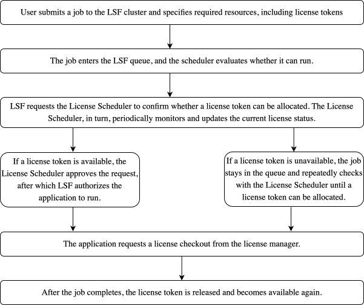

---

copyright:
  years: 2026
lastupdated: "2026-03-18"

keywords:
subcollection: hpc-ibm-spectrumlsf

---

{:external: target="_blank" .external}
{:shortdesc: .shortdesc}
{:screen: .screen}
{:pre: .pre}
{:table: .aria-labeledby="caption"}
{:codeblock: .codeblock}
{:tip: .tip}
{:download: .download}
{:important: .important}
{:note: .note}
{:new_window: target="_blank"}

# About LSF License Scheduler
{: #license-scheduler-overview}

{{site.data.keyword.spectrum_full}} License Scheduler enables shared use of licenses, offering significant advantages in both productivity and cost efficiency.

## Key features
{: #key-features}

* **Simplify license sharing:** License Scheduler makes it easy to share licenses across clusters and projects. It helps you assign and track license usage so that unused licenses can be shared, yet ensuring they are instantly available when required.

* **Ensure accurate license allocation:** License Scheduler provides flexible, hierarchical sharing policies based on business needs.

* **Enhance service quality and productivity:** License Scheduler reduces job queuing caused by license shortages, resulting in shorter wait times, higher productivity, and a more efficient design workflow.

## License Scheduler editions
{: #lsf-editions}

The LSF License Scheduler is available in two distinct editions - the Basic Edition and the Standard Edition.

### Basic Edition
{: #basic-edition}

The Basic Edition of LSF License Scheduler does not manage policies for sharing licenses between clusters or projects. Its purpose is to replace an external load information manager (**elim**) to collect external load indices for licenses managed by FlexNet or Reprise License Manager.

### Standard Edition
{: #std-edition}

The Standard Edition of LSF License Scheduler not only includes cluster‑mode features for a single cluster, but also delivers the full set of LSF License Scheduler capabilities. This includes support for all (**cluster and project mode**), all available features, and full support for the Service domain.

Each license feature can operate in either cluster mode or project mode, but not both.
{: important}

By default, the system is configured to use cluster mode. Users can modify the `sf.licensescheduler` file to switch to project mode.
{: note}

## Workflow
{: #lsf-sch-workflow}

The LSF License Scheduler manages license tokens, ensuring jobs start only when a token is available. The number of tokens matches the licenses on the server, preventing over‑allocation. When a job starts, the application is unaware of the **License Scheduler** and performs license checkout from the license server as usual.

{: caption="LSF License Scheduler Flowchart" caption-side="bottom"}
