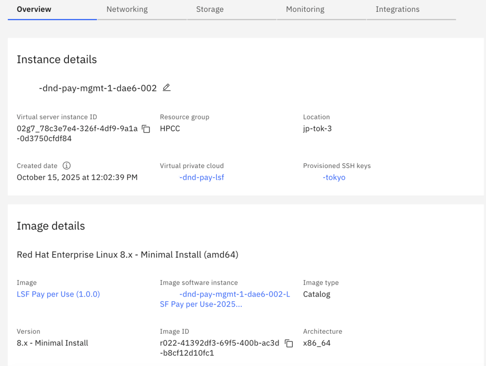

---

copyright:
  years: 2025
lastupdated: "2025-10-23"

keywords: lsf, pay-as-you-go
subcollection: hpc-ibm-spectrumlsf

---

{:external: target="_blank" .external}
{:shortdesc: .shortdesc}
{:screen: .screen}
{:pre: .pre}
{:table: .aria-labeledby="caption"}
{:codeblock: .codeblock}
{:tip: .tip}
{:download: .download}
{:important: .important}
{:note: .note}
{:new_window: target="_blank"}

# LSF Pay-As-You-Go (PAYGo) model
{: #payg-model-intro}

The LSF Pay-As-You-Go images are prebuilt and ready-to-use virtual machine images of {{site.data.keyword.spectrum_full_notm}} (Load Sharing Facility) that are available through the IBM Cloud Catalog. These images are designed for users who want to quickly deploy and use the LSF clusters without managing licenses or installation manually.

## Key aspects
{: #key-aspects}

Following are the key aspects of LSF Pay-As-You-Go model:

* **Prelicensed and Metered model**

    * Traditional LSF solution requires a license server with entitlements managed manually.

    * In PAYGo, the licensing is integrated into the image and billed automatically through IBM Cloud metering.

    * Users are charged based upon the actual usage, usually by the number of vCPUs or instance hours consumed.

* **Quick deployment**

    PAYGo is available directly in IBM Cloud, enabling users to deploy an LSF cluster within minutes using the Pay-Go images for management and compute nodes.

* **Simplified maintenance**

    The images are maintained, patched, and updated by the IBM team. This ensures that the users always have access to the latest tested and secure versions of LSF.

* **Flexible scaling**

    * Ideal for dynamic and burst workloads where compute demand fluctuates.

    * Users can scale up or down as needed without long-term commitments.

* **Integration with IBM Cloud HPC solution**

    These images are used as the base for automated cluster provisioning, integrating with Terraform, Ansible, and other automation tools.

## LSF PAYGo features
{: #paygo-feature}

The LSF Pay-As-You-Go (PAYGo) feature enables a flexible pricing model for {{site.data.keyword.spectrum_full_notm}} clusters based on vCPU usage per hour. With this solution, the users are billed proportionally for the compute resources that are consumed. This eliminates the need for upfront licensing costs.

### PAYGo Image Design
{: #paygo-image-design}

The PAYGo model leverages a custom prebuilt LSF image, which includes all necessary Fix Pack 15 (FP15) software components, RPMs, and configurations required to provision a complete LSF cluster. This single image supports all the following cluster node types:

* Management nodes

* Static and dynamic worker nodes

* Login nodes

The PAYGo image is built, validated, and managed by the automation team, ensuring consistent deployment across the environments. During cluster provisioning, all the nodes are incorporated using this PAYGo image version.

A backend pricing mechanism is integrated with the provisioning process, calculating costs based on the number of vCPU cores. By default, nodes are billed at $15 USD per 1000 vCPUs. The billing is automatically managed through the PAYGo pricing plan.

### PAYGo Configuration Variable
{: #paygo-config-variable}

A new configuration variable `lsf_pay_per_use` is introduced as part of this design.

* **Default value:** true

* **Purpose:** Controls whether the cluster uses the PAYGo pricing model or custom image-based provisioning.

When enabled, all the cluster nodes (management, compute, login, and dynamic) are automatically associated with the PAYGo pricing plan throughout their lifecycle. The overall instance cost is computed based on:

1. The selected instance hardware profile.
2. The PAYGo image pricing.
3. The associated volume storage.

## Use case 1: PAYGo mode enabled (lsf_pay_per_use = true)
{: #payg-usecase1}

When the PAYGo feature is enabled (default setting), then:
* The automation framework automatically detects the appropriate **pricing plan metrics** and provisions all the cluster nodes under the PAYGo model.

* Nodes are deployed using a **prebaked image** that includes all the required LSF and system packages.

* Customers **cannot use custom images** or add additional software layers when provisioning compute nodes.

* Dynamic node provisioning is also fully integrated into the PAYGo model through the **LSF Resource Connector**, ensuring that scaling operations use the same billing metrics.

In the PAYGo model, any custom image references provided for `management_instance`, `static_compute_instance`, `login_instances`, or `dynamic_compute_instances` are ignored.
The only supported PAYGo image is based on **Fix Pack 15 (FP15)**.
**Fix Pack 14 (FP14)** or earlier versions are not supported in the PAYGo model.
{: note}

This design ensures a consistent, reliable, and compliant image baseline across all deployed clusters, simplifying supportability and lifecycle management.

## Use case 2: PAYGo mode disabled (lsf_pay_per_use = false)
{: #payg-usecase2}

When the PAYGo feature is disabled, then:
* The automation process provisions clusters using the default or user-provided custom images.

* Users have the flexibility to bring their own images (BYOI) and pre-install additional tools, software, or dependencies tailored to their specific workloads.

The following image variables are used for provisioning:

* `management_instance`

* `static_compute_instance`

* `login_instances`

* `dynamic_compute_instances`

This mode provides greater customization capabilities for users who prefer full control over the cluster image configuration rather than using the standardized PAYGo model.

## Validation of the cluster
{: #cluster-validation}

From [Use case 1](/docs/hpc-ibm-spectrumlsf?topic=hpc-ibm-spectrumlsf-payg-model-intro#payg-usecase1), when `lsf_pay_per_use` is enabled, then all the cluster nodes are associated with the PayGo billing metrics. To confirm, after the cluster is created, you can verify the virtual server instances tagged with the appropriate pricing plan in the UI under the **Image Details** section.

{: caption="LSF PayGo user enabled" caption-side="bottom"}

However, when `lsf_pay_per_use` is enabled, the automation ensures that the necessary attributes are updated in the cluster configuration, allowing the LSF Resource Connector to retrieve the appropriate billing and pricing metrics.
{: note}

From [Use case 2](/docs/hpc-ibm-spectrumlsf?topic=hpc-ibm-spectrumlsf-payg-model-intro#payg-usecase2), when `lsf_pay_per_use` is disabled, then all the cluster nodes are associated with the default custom images that are supported by the solution or with the customer managed images.
To confirm, after the cluster is created, you can verify the virtual server instances tagged with the appropriate pricing plan in the UI under the **Image Details** section.

{: caption="LSF PayGo user disabled" caption-side="bottom"}

## Billing and Usage
{: #lsf-billing}

To view the billing in the IBM Cloud Catalog page, go to **Manage** > **Billing and usage**. On the left-hand side, click **Usage**. You will get a list of all the IBM Spectrum LSF clusters.

When the PayGo is enabled, search for **LSF Pay per Use** under Usage list, click **View Plans** and select **Spectrum LSF Pay per Use** and choose **View Details**.

{: caption="Billing and Usage details" caption-side="bottom"}

You will get the pricing for the selected Spectrum LSF Pay per Use.

{: caption="LSF Pay per use details" caption-side="bottom"}

Select the data for the required month.
{: note}
