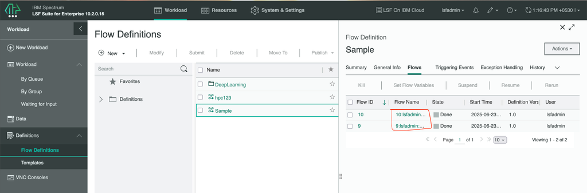

---

copyright:
  years: 2025
lastupdated: "2025-06-26"

keywords:

subcollection: hpc-ibm-spectrumlsf

---

{:shortdesc: .shortdesc}
{:codeblock: .codeblock}
{:screen: .screen}
{:external: target="_blank" .external}
{:pre: .pre}
{:tip: .tip}
{:note: .note}
{:important: .important}

# Managing Process Manager using GUI
{: #about-process-manager-gui}

Perform the following steps to create and verify the Process Manager using GUI:

1. Connect to the LSF management node through SSH. The details are available in the Schematics log output with the following `application_center_tunnel` variable:

    ```pre
    ssh -o StrictHostKeyChecking=no -o UserKnownHostsFile=/dev/null -o ServerAliveInterval=5 -o ServerAliveCountMax=1 -L 8443:10.241.0.7:8443 -L 6080:10.241.0.7:6080 -L 8444:10.241.0.7:8444 -J ubuntu@162.133.142.116 lsfadmin@10.241.16.6
    ```

2. Open a browser on your local system and run https://localhost:8443.

3. To access the Process Manager, open the **LSF Application Center GUI** in your browser. Log in using the default username `lsfadmin` and the password you set during workspace creation.

4. Navigate to **Workload** > **Definitions** > **Flow Definitions** > **New** > **Flow Definition** > **Import an example definition** in the Flow Editor.

    For more information, see [Exploring the flow definition examples](/docs/en/slac/10.2.0?topic=flow-exploring-definition-examples).

5. Creating a flow definition:

    * On the **Workload** tab, select **Workload** > **Definitions** > **Flow Definitions**.

    * Select **New** > **Flow Definition**.

    * In **Create Draft Definition** interface, select **Importing an example definition** in **Create definition by:** >. Select **Simple flow (Sample.xml)** example flow.

    * In **Definition Name** field, give your flow definition name and click **Create**. The Flow Editor displays your definition.

    * Select **Flow Definition** > **Save Draft (Ctrl-S)** to save your flow definition to the server.

    * After you finish editing your flow, select **Flow Definition** > **Exit Flow Editor**.

    {: caption="Create draft definition" caption-side="bottom"}

    For more information, see [Creating a flow definition](https://www.ibm.com/docs/en/slac/10.2.0?topic=definition-creating-flow).

6. Submitting your flow:

    You don't need to have a submission template to run the flow. You can directly submit a flow from the flow definition. The flow definition must be committed to the server as a new version.

    * In IBM Spectrum LSF Application Center, on the **Workload** tab, select **Definitions** > **Flow Definitions**.

    * In the list of flow definitions, select your flow definition and click **Submit**.

    {: caption="Flow definition" caption-side="bottom"}

    For more information, see [Submitting your flow](https://www.ibm.com/docs/en/slac/10.2.0?topic=basics-submitting-your-flow).

7. Monitoring your flow:

    You can view the information about a running or completed flow in the **Flow job** details:

    * On the **Workload** summary list, select a **Flow job** to monitor.

    * In the **Flow job** details pane, you can see the completed or running workload details.

    * Click **Flow Name** ID to see your completed workload as shown in the diagram.

    {: caption="Monitoring flow" caption-side="bottom"}

    For more information, see [Monitoring your flow](https://www.ibm.com/docs/en/slac/10.2.0?topic=basics-monitoring-your-flow).
