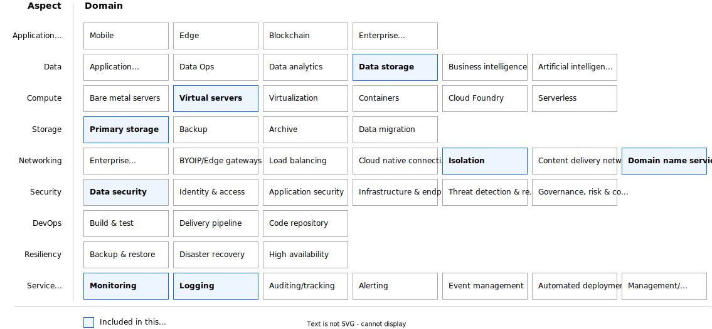

---

# The YAML header is required. For more information about the YAML header, see
# https://test.cloud.ibm.com/docs-internal/writing?topic=writing-reference-architectures

copyright:
  years: 2024
lastupdated: "2024-12-04"

keywords: # Not typically populated

subcollection: hpc-ibm-spectrumlsf # Use deployable-reference-architectures, or the subcollection value from your toc.yaml file if docs-only.

authors:
  - name: Sam P. User
    url: https://linkedin.com/in/sam-p-user
  - name: "name"
    url: "linkedIn profile URL"

# The release that the reference architecture describes
version: 1.0

# Use if the reference architecture has deployable code.
# Value is the URL to land the user in the IBM Cloud catalog details page for the deployable architecture.
# See https://test.cloud.ibm.com/docs/get-coding?topic=get-coding-deploy-button
deployment-url: url

docs: https://cloud.ibm.com/docs/solution-guide

image_source:

related_links:
  - title: 'Reference Architecture'
    url: 'https://url.com'
    description: 'Description.'
  - title: 'related or follow-on architectures'
    url: 'https://url'
    description: 'Description'

# use-case from 'code' column in
# https://github.ibm.com/digital/taxonomy/blob/main/topics/topics_flat_list.csv
use-case: IBM Spectrum LSF

# industry from 'code' column in
# https://github.ibm.com/digital/taxonomy/blob/main/industries/industries_flat_list.csv
industry:

# compliance from 'code' column in
# https://github.ibm.com/digital/taxonomy/blob/main/compliance_entities/compliance_entities_flat_list.csv
compliance:

content-type: reference-architecture

# For reference architectures in https://github.com/terraform-ibm-modules only.
# All reference architectures stored in the /reference-architectures directory

# Set production to true to publish the reference architecture to IBM Cloud docs.

production: false

---

{{site.data.keyword.attribute-definition-list}}

# Title
{: #ibm-spectrum-lsf}
{: toc-content-type="reference-architecture"}
{: toc-industry="value"}
{: toc-use-case="value"}
{: toc-compliance="value"}
{: toc-version="value"}

{{site.data.keyword.spectrum_full}} high-performance computing (HPC) clusters by using {{site.data.keyword.spectrum_full_notm}} as HPC scheduling software. This offering uses open source Terraform-based automation to provision and configure {{site.data.keyword.cloud_notm}} resources. {{site.data.keyword.spectrum_full_notm}} offers the option of a public virtual machine, or virtual machines that are deployed on dedicated hosts, for static compute nodes only. The management nodes and dynamic compute nodes use public virtual machines only.

## Architecture diagram
{: #architecture-diagram}

{: caption="IBM Spectrum LSF architecture diagram" caption-side="bottom"}

## Design concepts
{: #design-concepts}

The following architecture framework design heatmap covers design considerations and architecture decisions for the following aspects and domains:

* **Data:** Data storage
* **Compute:** Virtual servers
* **Storage:** Primary storage
* **Networking:** Isolation and domain name service
* **Security:** Data security
* **Service management:** Logging and automated deployment

{: caption="Architecture design scope" caption-side="bottom"}

## Requirements
{: #requirements}

The following table outlines the requirements that are addressed in this architecture.

| Aspect | Requirements |
| -------------- | -------------- |
| Data            | * Provide a location to store {{site.data.keyword.spectrum_full_notm}} configuration and data. |
| Compute            | * Provide properly isolated compute resources with adequate compute capacity for the applications. |
| Storage            | * Provide storage that meets the application and database performance requirements. |
| Networking         | * Deploy workloads in isolated environment and enforce information flow policies. \n * Distribute incoming application requests across available compute resources. \n * Support failover of application within the cluster event of planned or unplanned node outage \n Provide private DNS resolution to support use of hostnames instead of IP addresses. |
| Security           | * Ensure all operator actions are executed securely through a bastion host. \n * Provide customers with the ability to use keys to ensure that all data meets regulatory compliance requirements for additional security and customer control. \n * Protect secrets through their entire lifecycle and secure them using access control measures.|
| Service Management | * Monitor system and application health metrics and logs to detect issues that might impact the availability of the application. \n * Monitor audit logs to track changes and detect potential security problems. |
{: caption="Requirements" caption-side="bottom"}

## Components
{: #components}

| Aspects | Requirement | Architecture component | How the component is used |
|-------------|-------------|-----------|--------------------|
| Data and Storage | Create file shares | [{{site.data.keyword.filestorage_vpc_full_notm}}](/docs/vpc?topic=vpc-file-storage-vpc-about) or optinally [{{site.data.keyword.scale_full}}](/docs/storage-scale?topic=storage-scale-getting-started-tutorial)| Creates file shares for configuring user file data sharing. |
| Compute | Provide infrastructure and administration access | HPC VPC service | Provides a VPC service so that you can log in and submit an HPC job. |
|  | Create virtual server instances to support bastion. | Bastion node | Create a VPC virtual server instance for bastion and special-purpose servers used to manage access to a private network from an external network, typically the internet. |
|  | Create virtual server instances to support management. | Login node | Creates a VPC virtual server instance for so that you can log in and submit HPC jobs. |
|  | Create virtual server instances that run LSF as a distributed batch HPC application for HPC workload (jobs). | HPC management node | Creates a VPC virtual server instance that runs LSF as a distributed batch HPC application for HPC workloads.|
| Networking | * Isolate bastion, login, and HPC management nodes.  \n * Limit the number of connections to the bastion node.  \n * Restrict management subnet access to bastion and customer's host or CIDR. | Security group rules for each subnet | As an alternative choice, more CIDR or ports can be manually added after deployment. |
|  | Enable floating IP on bastion node for customer access. | Floating IP on the bastion node | Allows customer access to the HPC VPC. |
|  | Enable public gateway for the HPC management subnet. | Public gateway for management subnet | Allows outbound communication for the HPC management node for any internet access (for example, repositories, packages, and so on). |
|  | DNS service for the HPC compute nodes | DNS service | Helps with the IP and name resolution for the HPC compute nodes. |
|  | (Optional) Load VPN configuration to simplify VPN setup. | VPN | VPN configuration is the responsibility of the customer. |
| Security | Create virtual server instances to support management. | Bastion node | Configures security group rules to allow access to {{site.data.keyword.cloud_notm}} services. |
|  | Create virtual server instances to support management. | Login node | Configures security group rules to allow access to {{site.data.keyword.cloud_notm}} services. |
|  | Create virtual server instances that run LSF as a distributed batch HPC application for HPC workload (jobs). | HPC management node | Configures security group rules to allow access to {{site.data.keyword.cloud_notm}} services. |
|  | (Optional) Provide customers with the ability to use keys to ensure that all data meets regulatory compliance requirements for additional security and customer control. | [{{site.data.keyword.keymanagementservicefull}}](/docs/key-protect) | Provides the ability to use keys to ensure that all data meets regulatory compliance requirements for additional security and customer control. |
|  | (Optional) Protect secrets through their entire lifecycle and secure them using access control measures. | [{{site.data.keyword.cloud}} Secrets Manager](/docs/secrets-manager?topic=secrets-manager-getting-started&interface=ui) | Protects secrets through their entire lifecycle and secure them using access control measures.
| Service Management | Schedule and run distributed batch HPC applications. | [IBM Spectrum LSF](https://www.ibm.com/docs/en/spectrum-lsf/10.1.0){: external} cluster includes:  \n * Management nodes: Run LSF internal management highly available components.  \n * Dynamic compute nodes: Computational hosts where LSF runs the HPC workload and can be placed in one or two zones. | IBM Spectrum LSF software is industry-leading and enterprise-class. LSF provides a resource management framework that takes your job requirements, dynamically requests the best resources from the cloud to run the job, monitors its progress, and releases the resource after the workload completion. |
|  | (Optional) Monitor system and application health metrics and logs to detect issues that might impact the availability of the application. | [{{site.data.keyword.monitoringfull_notm}}](/docs/monitoring?topic=monitoring-getting-started) | Monitors system and application health to detect issues that might impact the availability of the application. |
|  | (Optional) Monitor audit logs to track changes and detect potential security problems. | [{{site.data.keyword.atracker_full}}](/docs/atracker?topic=atracker-getting-started) | Monitors audit logs to track changes and detect potential security problems. |
{: caption="Components" caption-side="bottom"}

## Compliance
{: #compliance}

_Optional section._ Feedback from users implies that architects want only the high-level compliance items and links off to control details that team members can review. Include the list of control profiles or compliance audits that this architecture meets. For controls, provide "learn more" links to the control library that is published in the IBM Cloud Docs. For audits, provide information about the compliance item.

## Next steps
{: #next-steps}

_Optional section._ Include links to your deployment guide or next steps to get started with the architecture.

:exclamation: **Important:** Rename this file `<architecture-name>.md`. For deployable architectures, `<architecture-name>` is the same as the deployable architecture name.
