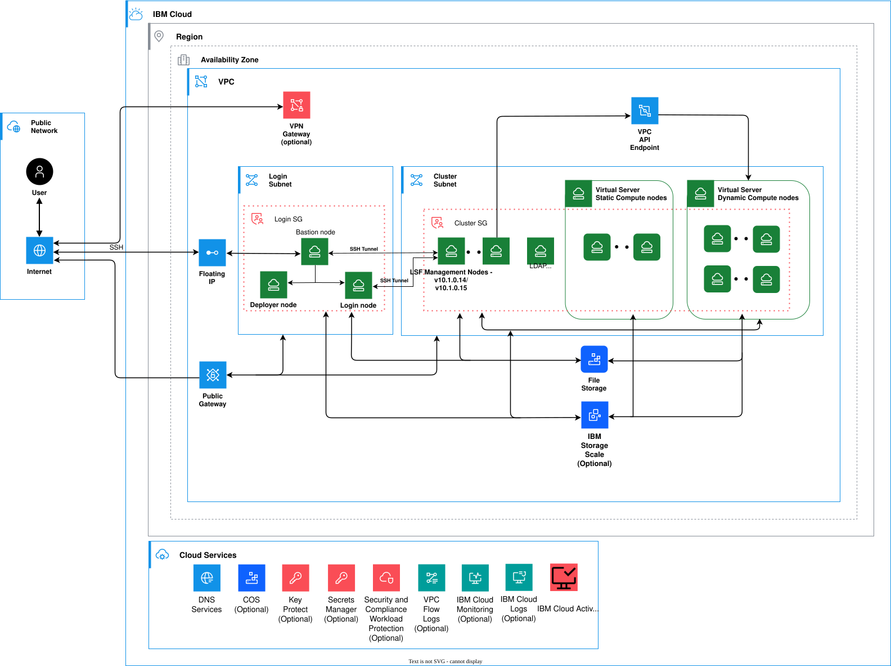
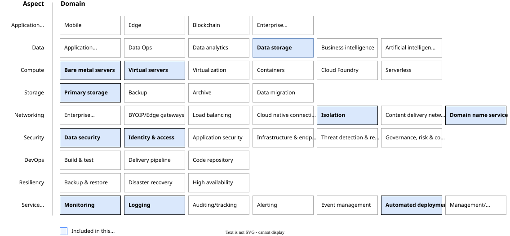

---

copyright:
  years: 2026
lastupdated: "2026-06-15"

keywords: # Not typically populated

subcollection: hpc-ibm-spectrumlsf

authors:
  - name: David Nguyen

deployment-url: https://cloud.ibm.com/catalog/architecture/deploy-arch-ibm-hpc-lsf-1444e20a-af22-40d1-af98-c880918849cb-global?catalog_query=aHR0cHM6Ly9jbG91ZC5pYm0uY29tL2NhdGFsb2cjaGlnaGxpZ2h0cw%3D%3D

docs: https://cloud.ibm.com/docs/solution-guide

image_source:

use-case: IBM Spectrum LSF
industry: Electronics, Healthcare, LifeSciences, Automotive, AerospaceAndDefense
compliance:
content-type: reference-architecture

production: false

---
{{site.data.keyword.attribute-definition-list}}

# IBM Spectrum LSF
{: #ibm-spectrum-lsf}
{: toc-content-type="reference-architecture"}
{: toc-industry="Electronics, Healthcare, LifeSciences, Automotive, AerospaceAndDefense"}
{: toc-use-case="IBMSpectrumLSF"}

{{site.data.keyword.spectrum_full}} enables High-Performance Computing (HPC) clusters by using LSF as the HPC scheduling software. This solution employs a deployable architecture to provision and configure IBM Cloud resources. It supports public virtual machines or virtual machines on dedicated hosts for static compute nodes. However, management nodes and dynamic compute nodes are exclusively deployed by using public virtual machines.

## Architecture diagram
{: #architecture-diagram}

{: caption="IBM Spectrum LSF architecture diagram" caption-side="bottom"}

## Design concepts
{: #design-concepts}

The architecture framework design covers design considerations and architecture decisions for the following aspects and domains:

* **Data:** Data storage
* **Compute:** Virtual servers and Bare metal
* **Storage:** Primary storage
* **Networking:** Isolation and domain name service
* **Security:** Data security
* **Service management:** Logging and automated deployment

{: caption="Architecture design scope" caption-side="bottom"}

## Requirements
{: #requirements}

The following table outlines the requirements that are addressed in this architecture.

| Aspect | Requirements |
| -------------- | -------------- |
| Data            | Provide a location to store {{site.data.keyword.spectrum_full_notm}} configuration and data. |
| Compute            | Provide properly isolated compute resources with adequate compute capacity for the applications. |
| Storage            | Provide storage that meets the application and database performance requirements. |
| Networking         | * Deploy workloads in an isolated environment and enforce information flow policies. \n * Distribute incoming application requests across available compute resources. \n * Support failover of application within the cluster event of planned or unplanned node outage. \n * Provide private DNS resolution to support the use of hostnames instead of IP addresses. |
| Security           | * Ensure that all operator actions are run securely through bastion host. \n * Provide users with the ability to use keys to ensure that all data meets regulatory compliance requirements for more security and user control. \n * Protect secrets through their entire lifecycle and secure them using access control measures.|
| Service Management | * Monitor system and application health metrics and logs to detect issues that might impact the availability of the application. \n * Monitor audit logs to track changes and detect potential security problems. |
{: caption="Requirements" caption-side="bottom"}

## Components
{: #components}

| Aspects | Requirement | Architecture component | How the component is used |
|-------------|-------------|-----------|--------------------|
| Data and Storage | Create file shares | [{{site.data.keyword.filestorage_vpc_full_notm}}](/docs/vpc?topic=vpc-file-storage-vpc-about) or optionally [{{site.data.keyword.scale_full}}](/docs/allowlist/storage-scale-da?topic=storage-scale-da-overview-storage-scale)| Creates file shares for configuring user file data sharing. |
| Compute | Provide infrastructure and administration access | VPC service | Provides a VPC service so that you can log in and submit an HPC job. |
|  | Create virtual server instances to support deployment. | Deployer node | Creates a  virtual server instance for performing the entire LSF cluster deployment. |
|  | Create virtual server instances to support bastion. | Bastion node | Create a VPC virtual server instance for bastion and special-purpose servers that are used to manage access to a private network from an external network, typically the internet. |
|  | Create virtual server instances to support lsf client node. | Login node | Creates a VPC virtual server instance for so that you can log in and submit HPC jobs. |
|  | Create virtual server instances that run LSF as a distributed batch HPC application for HPC workload (jobs). | LSF management node | Creates a VPC virtual server instance that runs LSF as a distributed batch HPC application for HPC workloads.|
|  | Create virtual server instances or bare-metal to support static compute nodes. | Static compute node | Creates a VPC virtual server instance for so that you can log in and submit HPC jobs. |
|  | Create virtual server instances or spot instances to support dynamic compute nodes. | Dynamic compute node | Creates a VPC virtual server instance for so that you can log in and submit HPC jobs. |
| Networking | Enable floating IP on bastion node for user access. | Floating IP on the bastion node | Allows user access to the VPC. |
|  | Enable a public gateway for the management subnet. | Public gateway for management subnet | Allows outbound communication for the LSF management node for any internet access (for example, repositories, packages, and so on). |
|  | DNS service for the compute nodes | DNS service | Helps with the IP and name resolution for the compute nodes. |
|  | (Optional) Load VPN configuration to simplify VPN setup. | VPN | VPN configuration is the responsibility of the user. |
| Security | Isolate bastion, login, deployer, and LSF cluster nodes. | Two different subnets are created. Bastion and login nodes under one subnet and LSF cluster nodes under another subnets. | Configures security group rules to allow access to IBM Cloud services. |
|  | Limit the number of connections to the bastion node. | Only a required connections are enabled to access the bastion node | |
|  | Restrict management subnet access to bastion and users host or CIDR. | To have the cluster configurations working, updated only the VPC range of IP for security | |
|  | (Optional) Provide users with the ability to use keys to ensure that all data meets regulatory compliance requirements for more security and user control. | [{{site.data.keyword.keymanagementservicefull}}](/docs/key-protect) | Provides the ability to use keys to ensure that all data meets regulatory compliance requirements for more security and user control. |
| Observability | (Optional) Monitor system and application health metrics and logs to detect issues that might impact the availability of the application. | [{{site.data.keyword.monitoringfull_notm}}](/docs/monitoring?topic=monitoring-getting-started) | Monitors system and application health to detect issues that might impact the availability of the application. |
|  | (Optional) Monitor audit logs to track changes and detect potential security problems. | [{{site.data.keyword.atracker_full}}](/docs/atracker?topic=atracker-getting-started) | Monitors audit logs to track changes and detect potential security problems. |
| Service Management | Schedule and run distributed batch HPC applications. | [IBM Spectrum LSF](https://www.ibm.com/docs/en/spectrum-lsf/10.1.0){: external} cluster includes:  \n * Management nodes: Run LSF internal management is highly available components.  \n * Dynamic compute nodes: Computational hosts where LSF runs the HPC workload and can be placed in a single zone. | {{site.data.keyword.spectrum_full_notm}} software is industry-leading and enterprise-class. LSF provides a resource management framework that takes your job requirements, dynamically requests the best resources from the cloud to run the job, monitors its progress, and releases the resource after the workload completion. |
{: caption="Components" caption-side="bottom"}
