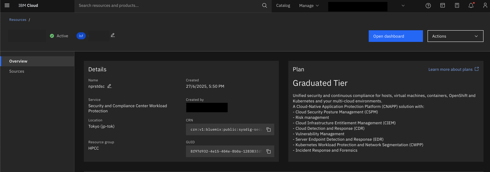

---

copyright:
  years: 2025
lastupdated: "2025-06-30"

keywords:

subcollection: hpc-ibm-spectrumlsf

---

{:shortdesc: .shortdesc}
{:codeblock: .codeblock}
{:screen: .screen}
{:external: target="_blank" .external}
{:pre: .pre}
{:tip: .tip}
{:note: .note}
{:important: .important}
{:table: .aria-labeledby="caption"}

# IBM Cloud Security and Compliance Center Workload Protection
{: #scc-overview}

IBM Cloud® Security and Compliance Center Workload Protection (SCCWP) helps you accelerate your hybrid cloud adoption by addressing security and regulatory compliance. Easily identify vulnerabilities, validate compliance and permissions, block runtime threats and respond to incidents faster across any platform: Cloud or on-prem, hosts or VMs and containers or OpenShift/Kubernetes. A cloud-native application protection platform (CNAPP) powered by runtime insights.

Workload protection is an IBM service, placed under the Observability and Compliance section. Through this solution, automation of the workload protection is created. SCC Workload Protection is an agentless and does not need anything to be installed. When Cloud Security Posture Management (CSPM) is enabled, then the posture management will help you to populate the data.

Workload protection is supported majorly in these 3 pillars:
1. Posture management
2. Vulnerability management
3. Threat detection and response

* **Posture Management:**

Provides a unified and centralized platform to manage the security and compliance of applications, workloads, and infrastructure that run on IBM Cloud. In other clouds, and on-prem, covering managed services, hosts. Cloud Security Posture Management (CSPM) help you to identify misconfigurations and validate compliance across IBM Cloud. This also offers an inventory to all your Cloud assets (compute resources, managed services, identities, entitlements, hosts, virtual machines, and clusters), whether they are in the Cloud or on-premises.

* **Vulnerability management**

Scanning for vulnerabilities on OS packages and third-party libraries such as Java, Python, Golang, Javascript, or Ruby. This offers vulnerability management overview dashboard, advanced and customizable reporting, alerting of new vulnerabilities or unscanned images and routing to ticketing systems. Advanced policies to customize vulnerability criteria and blocking per environment or any scope.

* **Threat detection and response**

In addition to rules, behavioral analysis allows detection of common threats and malware such as crypto mining activities and workload profiling to automatically define expected behavior that can extend detection capabilities. Advanced remediation, allowing to automatically run corrective actions including killing processes, killing or pausing containers, and so on.

## SCC Workload Protection on IBM Spectrum LSF cluster
{: #scc-lsf-cluster}

The following new variables are introduced for SCC Workload Protection:

* `sccwp_enable`: To create the SCC Workload Protection, set the value to "true". By default, this value is set as true. If you set the value as "false" the SCC Workload Protection will not be created.

* `sccwp_service_plan`: this is used to enable the service plan for SCC Workload Protection. Valid values are free-trial and graduated-tier only.

* `cspm_enabled` - enable this variable for the Workload Protection instance.

By default the value for `cspm_enabled` is set to "true". This is expected to be set as true, so that the posture management data will only be available on the dashboard.
{: note}

* `app_config_plan` - specify the IBM service pricing plan for the application. Allowed values are 'basic', 'lite', 'standard', 'enterprise'.

## About IBM Cloud Security Posture Management (CSPM)
{: #about-cspm}

In IBM Cloud, IBM Cloud® Security and Compliance Center Workload Protection automates compliance checks for IBM Cloud Framework for Financial Services, Digital Operational Resilience Act (DORA), CIS IBM Cloud Foundations Benchmark, PCI and many other industry related or best practices standards. With a detailed inventory of your IBM Cloud resources and prioritization based on full context it facilitates the resolution and management of collected violations.

The module brings many features for your CSPM in your hybrid environments:

* Unified and centralized view to manage security and compliance of applications, workloads and infrastructure running on IBM Cloud, in other cloud providers and on-premise, covering managed services, hosts, virtual machines and containers and Kubernetes or OpenShift clusters.
* Many predefined frameworks such as Financial Services, PCI, DORA, CIS or NIST allow to implement and validate the controls that are required to meet industry standards and laws.
* Inventory of all your cloud assests (compute resources, managed services, identities, and entitlements) and hosts, virtual machines, clusters and all Kubernetes or OpenShift resources, whether they are in the cloud or on-premises.
* A risk acceptance flow for removing the violation from the failed controls with options for the reason and expiration period for the acceptance. Risk can be accepted at one resource level or globally for all resources from one control.
* Detailed remediation instructions to fix failing controls.
* Ability to create custom policies, controls, and control parameters.
* Capability to integrate all your Workload Protection accounts and enterprise seamlessly.

## Accessing the SCC Workload Protection
{: #accessing-scc}

When you access the UI for the service, all the above mentioned pillars are covered (Threat/Vulnerabilities/Compliance).

1. Go to the {{site.data.keyword.cloud_notm}} console, in the **Navigation Menu**, click **Security** > **Compliance**.

    In the **Search** field, type the name and you will find the SCC Workload Protection page. To view the dashboard, click **Open dashboard**.

    {: caption="Security and Compliance Workload protection dashboard" caption-side="bottom"}

2. Once the CSPM is enabled, all the data from the back-end will be pushed to the dashboard as shown below:

    {: caption="SCC Compliance" caption-side="bottom"}

3. When the `app_config_plan` is enabled, the configuration aggregator records the data from all the resources across regions in your account.

    {: caption="SCC Application configuration" caption-side="bottom"}

4. Inventory is agentless, which is provided by IBM cloud. In the account we have 1000 resources, you can add the filters and validate all the resources of the inventory (Security groups/Instances/FIP) etc. For an example, when a certain security group does not have the rules set, then all of them can be monitored here.

    {: caption="SCC Application configuration" caption-side="bottom"}

5. Under **Policies**, you can go ahead and configure the policies. Based on Linux or RHEL platform, certain policies can be set. These are set of rules, based on which you can configure the policy.

    {: caption="SCC runtime policies" caption-side="bottom"}

6. On **Vulnerabilities**, you can run the scans and this shows the severity of the issues and that could be helped to be scanned. You can filter based on high, medium, and low. For more information, see [Scanning Guidelines](https://docs.sysdig.com/en/sysdig-secure/scanning-usecases/){: external}.

    {: caption="Dashboard view for SCCWP" caption-side="bottom"}
