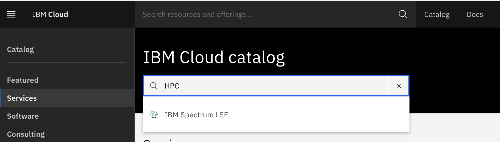

---

copyright: 
  years: 2025
lastupdated: "2025-01-22"

keywords: architecture overview, cluster access, hpc cluster
content-type: tutorial
services: virtual-servers, vpc, loadbalancer-service
account-plan: paid
completion-time: 60m
subcollection: hpc-ibm-spectrumlsf

---

{:external: target="_blank" .external}
{:shortdesc: .shortdesc}
{:screen: .screen}
{:pre: .pre}
{:table: .aria-labeledby="caption"}
{:codeblock: .codeblock}
{:tip: .tip}
{:download: .download}
{:important: .important}
{:note: .note}
{:new_window: target="_blank"}
{:step: data-tutorial-type='step'}

# Setting up an IBM Spectrum LSF cluster
{: #using-hpc-cluster}

Deploy the HPC cluster with your choice of configuration properties.

## Architecture overview and VPC File Storage setup 
{: #hpc-cluster-architecture-overview}

The LSF cluster consists of a bastion, lsf login client node, 1 - 10 LSF management nodes, and some LSF worker nodes. Where the VPC file storage is attached to lsf login client node/management and worker nodes.

* The bastion node is served as a jump host and it is the only node that has the public IP address. Other nodes have only private IP addresses and the only way to reach these nodes is through the bastion node. You can log in to the primary LSF management host and do most of the operations from the LSF management host. By default, `lsfadmin` is the only user ID created on the cluster. The SSH passwordless setup is configured between the LSF management host and workers. You can reach any other worker node with the `lsfadmin` user ID from the LSF primary.

* The lsf login client nodes are used to submit the jobs and it is not intended to run the jobs. To reach the login node is through the bastion node. Instead of accessing the management node, users can directly access the login node and submit and manage the entire cluster.

* The worker node can be a static resource. In this case, its lifecycle is managed by Schematics. You can request some static worker nodes, and these workers remain available in the LSF cluster until a Schematics-destroy action is performed. The LSF resource connector function creates extra workers when there is not enough capacity to run jobs and destroys workers when the demands decrease. The lifecycle of these dynamic workers is managed by the LSF resource connector. Wait until these dynamic resources are returned to the cloud before you destroy the entire VPC cluster through Schematics.

* The {{site.data.keyword.cloud_notm}} File Storage for VPC is used for file sharing. By default, there are two file share volumes; each is 100 GB. To change this configuration, [set the custom_file_shares deployment value](/docs-draft/hpc-ibm-spectrumlsf?topic=hpc-ibm-spectrumlsf-spectrum-lsf-faqs&interface=ui#share).

The HPC cluster solution provides a base custom image, which includes the LSF installation. You can still create customizable custom image with the installation of the required packages. For more information, see [Create custom image](/docs/ibm-spectrum-lsf?topic=ibm-spectrum-lsf-getting-started-tutorial&interface=ui#create-custom-image). You can then specify the custom image that is created in the IBM Spectrum LSF tile under the `compute_image_name`(worker nodes). The image that is used by the login node and the storage node is not configurable at the moment (CentOS 7 by default).

## Create SSH key
{: #hpc-ssh-key-creation-before}
{: step}

Complete the following steps to create your SSH key:

1. Generate an SSH key on your system by running the following command: 

    ```
    ssh-keygen -t rsa
    ```
    {: pre}

2. Copy and save all the content from `.ssh/id_rsa.pub`.

## Add SSH key to the VPC infrastructure
{: #hpc-ssh-key-adding}
{: step}

1. Log in to the [{{site.data.keyword.cloud}} console](https://cloud.ibm.com/){: external} by using your unique credentials.
2. From the dashboard, click **Menu icon  > VPC Infrastructure > SSH keys**.
3. Click Create.
4. Enter the SSH key name (for example, `po-ibm-ssh-key`), select the default resource group, add tags, and select the region. 
5. Copy and paste the public key into the _Public key_ field (the contents that you saved from `.ssh/id_rsa.pub`).
6. Click Add SSH key.

## Create API key
{: #hpc-api-key}
{: step}

Complete the following steps to create your API key:

1. In the {{site.data.keyword.cloud_notm}} console, go to **Manage > Access (IAM) > API keys**.
2. Click **Create an IBM Cloud API key**.
3. Enter a name and description for your API key.
4. Click Create.
5. Then click Show to display the API key, **Copy** to copy and save it for later, or click Download.

## Create and configure an HPC/LSF cluster from the IBM Cloud catalog
{: #hpc-cluster-creation}
{: step}

Complete the following steps to create and configure an HPC cluster from the {{site.data.keyword.cloud_notm}} catalog:

1. In the {{site.data.keyword.cloud_notm}} catalog, search for _HPC_ or _Spectrum LSF_, and then select IBM Spectrum LSF. 

    {: caption="HPC cluster solution page"}

2. In the **Set the deployment values** section, supply the required values: `api_key`, `ibm_customer_number`, `remote_allowed_ips`, `ssh_key_name`, and `zone`. 

3. After you confirm with the license agreement, you can use the default values for other parameters and click Install. The HPC cluster is created and completed within 15 minutes with the default configuration.

IBM Spectrum LSF supports different features like PAC/PAC HA/SCC/Observability/Hyperthreading/Cloud Logs/Monitoring/VPN etc. To configure all the features, refer to the [deployment values](/docs-draft/hpc-ibm-spectrumlsf?topic=hpc-ibm-spectrumlsf-deployment-values&interface=ui) section.
{: note} 

### Parameters for auto scaling
{: #hpc-cluster-auto-scaling-parameters}

You can set the following parameters for auto scaling:

* `worker_node_min_count`: The minimum number of worker nodes that are provisioned at the time the cluster is created and remain running regardless of job demands in the cluster.

* `worker_node_max_count`: The maximum number of worker nodes in your HPC cluster, which limits the number of systems that can be added to an HPC cluster. LSF auto scaling scales up the cluster to this number of nodes when needed for your workloads and scales back for keeping only`worker_node_min_count` workers when no job is in the queues.

### Parameters for instance profiles
{: #hpc-cluster-instance-profiles-deployment-parameters}

You can control the instance profile for each instance type through the `xxx_node_instance_type` parameters. The management nodes are where the main LSF daemons are running. You need to select ones with more compute power if you plan to run jobs by using 100+ nodes. The worker nodes are the ones where the workload execution takes place and the choice needs to be made according to the characteristic of workloads.

## Accessing the HPC cluster
{: #hpc-cluster-access}
{: step}

To access your HPC cluster, complete the following steps:

1. Go to Schematics > Choose the name for your workspace > Plan applied > View log.

2. Copy `ssh-command` to access your cluster.

    * `ssh -J root@ip-jumphost lsfadmin@ip-managementhost`

    * The `ip-jumphost` is `public`, while the `ip-managementhost`is not.

    * `-J flag`: Connects to the jump-host and establishes a TCP forwarding to the ultimate destination (management host).

## Auto scaling
{: #hpc-cluster-auto-scaling}
{: step}

You have a minimum number of worker nodes (`worker_node_min_count`). This is the number of worker nodes that are provisioned at the time the cluster is created. However, you can use a maximum number of worker nodes that should be added to the {{site.data.keyword.spectrum_short}} cluster defined by `worker_node_max_count`. This is to limit the number of systems that can be added to {{site.data.keyword.spectrum_short}} cluster when the auto scaling configuration is used. This property can be used to manage the cost associated with {{site.data.keyword.spectrum_short}} cluster instance.

The following example shows `worker_node_min_count=2` and `worker_node_max_count=10`.

1. To check the two worker nodes, run the following command: 

    ```
    bhosts -w
    ```
    {: pre}

    Example output:

    {: caption="Two worker nodes"}

2. To try the auto scaling function, run a job that requires more than two nodes. For example, this job requires five jobs to sleep for 10 seconds:

    ```
    bsub -n 5 -R "span[ptile=1]" sleep 10
    ```
    {: pre}

3. The job is submitted.

4. After a minute, check the nodes by running the following command:

    ```
    bhosts -w
    ```
    {: pre}
     
    You can see that now five nodes were added to your cluster:

    {: caption="Five worker nodes added"}

5. The difference of nodes that are created by the auto scaling function are destroyed automatically after 10 minutes of not being used.

## Set up hybrid connectivity (Optional)
{: #optional-hybrid-connectivity}
{: step}

If you want to set up a hybrid connectivity environment by using VPN, see the instructions [Installing a VPN to an HPC cluster](/docs-draft/hpc-ibm-spectrumlsf?topic=hpc-ibm-spectrumlsf-install-vpn-hpc-cluster).

If you would like to use Direct Link, see the instructions for [Installing Direct Link to an HPC cluster](/docs-draft/hpc-ibm-spectrumlsf?topic=hpc-ibm-spectrumlsf-installing-direct-link-cluster).

## Using OpenLDAP with IBM Spectrum LSF
{: #using-openladap-spectrum-lsf}
{: step}

If you want to know more about OpenLDAP with {{site.data.keyword.spectrum_full_notm}}, see [About OpenLDAP with IBM Spectrum LSF](/docs-draft/hpc-ibm-spectrumlsf?topic=hpc-ibm-spectrumlsf-integrate-openldap-spectrum-lsf).

During deployment, you enable OpenLDAP with your {{site.data.keyword.spectrum_full}} cluster by setting the `enable_ldap`,`ldap_basedns`, `ldap_server`, `ldap_admin_password`, `ldap_user_name`, and `ldap_user_password` deployment input values.

If you want to know more about integrating OpenLDAP with your {{site.data.keyword.spectrum_full}} cluster, see [Integrating OpenLDAP with your IBM Spectrum LSF cluster](/docs-draft/hpc-ibm-spectrumlsf?topic=hpc-ibm-spectrumlsf-integrate-openldap-spectrum-lsf).

## Create DNS zones and DNS custom resolver
{: #dns-zones-custom-resolvers}
{: step}

 If you leave the `dns_instance_id` deployment input value as null, the deployment process creates a new DNS service instance ID in the respective DNS zone. Alternatively, provide an existing [IBM Cloud® DNS Service instance ID](/docs-draft/hpc-ibm-spectrumlsf?topic=hpc-ibm-spectrumlsf-dns-custom-resolvers) for the `dns_instance_id` deployment input value.

If you leave the `dns_custom_resolver_id` deployment input value as null, the deployment process creates a new VPC and enables a new custom resolver for your cluster. Alternatively, to create custom DNS resolvers with an existing VPC, provide the resolver ID for the `dns_custom_resolver_id` deployment input value. For more information, see [DNS custom resolvers for your IBM Spectrum LSF cluster](/docs-draft/hpc-ibm-spectrumlsf?topic=hpc-ibm-spectrumlsf-dns-custom-resolvers&interface=ui#custom-resolvers).

## Using IBM Key Protect instances to manage data encryption
{: #key-protect-encryption}
{: step}

To manage the data encryption to your virtual server instances, use the IBM Key Protect instance through {{site.data.keyword.spectrum_full_notm}} cluster. For more information on Key Protect and encryption keys, see [IBM® Key Protect and encryption keys](/docs-draft/hpc-ibm-spectrumlsf?topic=hpc-ibm-spectrumlsf-key-protect).
